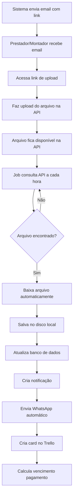

# 📥 DOCUMENTAÇÃO: COLETA AUTOMÁTICA DE ARQUIVOS DA API

> **Como o sistema detecta e baixa automaticamente os arquivos de Notas Fiscais quando prestadores/montadores fazem upload na API DV Processamento**

---

## 📋 ÍNDICE

1. [Visão Geral do Fluxo](#1-visão-geral-do-fluxo)
2. [Arquivos Envolvidos](#2-arquivos-envolvidos)
3. [Fluxo Detalhado Passo a Passo](#3-fluxo-detalhado-passo-a-passo)
4. [Estrutura da API](#4-estrutura-da-api)
5. [Estrutura de Dados](#5-estrutura-de-dados)
6. [Processamento de Prestadores](#6-processamento-de-prestadores)
7. [Processamento de Montadores](#7-processamento-de-montadores)
8. [Integração com Trello](#8-integração-com-trello)
9. [Notificações e WhatsApp](#9-notificações-e-whatsapp)
10. [Configuração e Monitoramento](#10-configuração-e-monitoramento)

---

## 1. VISÃO GERAL DO FLUXO

### 🔄 Ciclo Completo:



### ⏰ Frequência:
- **Job automático** executa **A CADA HORA**
- Configurável via `painel_jobs.py` (interface Streamlit)
- Pode ser executado manualmente: `python job_consultar_notas.py`

---

## 2. ARQUIVOS ENVOLVIDOS

### 📄 Arquivos Principais:

| Arquivo | Função | Linhas |
|---------|--------|--------|
| **`job_consultar_notas.py`** | Job principal - orquestra todo o processo | 485 |
| **`consulta_nf_client.py`** | Cliente HTTP para comunicar com a API | 387 |
| **`database.py`** | Funções de banco de dados (salvar, atualizar) | ~1596 |
| **`integracoes/trello_integration.py`** | Criação de cards no Trello | 470 |
| **`whatsapp_triggers.py`** | Disparo automático de WhatsApp | - |

### 🔧 Arquivos de Suporte:

- **`api_upload_client.py`** - Cliente para ENVIAR dados para API (criação de links)
- **`scheduler_service.py`** - Serviço que agenda execução do job
- **`painel_jobs.py`** - Interface visual para controlar jobs

---

## 3. FLUXO DETALHADO PASSO A PASSO

### 🎯 FASE 1: Identificação de Pendências

```python
# Arquivo: job_consultar_notas.py (linha ~48)

def processar_uploads_pendentes():
    # 1. Buscar lotes de PRESTADORES aguardando NF
    lotes = db.get_lotes_upload_pendente()
    # SQL: SELECT * FROM lotes_servico WHERE status_arquivo IN (0, 1)
    
    # 2. Buscar envios de MONTADORES aguardando NF
    envios_montagem = db.get_envios_montagem_upload_pendente()
    # SQL: SELECT * FROM envios_montagem WHERE status_arquivo IN (0, 1)
```

**Status do Arquivo:**
- `0` = Pendente (aguardando upload)
- `1` = Upload iniciado (arquivo em processamento)
- `2` = Baixado (arquivo já coletado)

---

### 🎯 FASE 2: Consulta na API

```python
# Arquivo: job_consultar_notas.py (linha ~77)

for lote in lotes:
    upload_hash = lote.get('upload_hash')  # Hash único do link
    
    # Consultar API usando o hash
    client = ConsultaNFClient()
    sucesso, dados, erro = client.consultar_e_processar(upload_hash)
```

#### 🔌 Requisição HTTP:

```python
# Arquivo: consulta_nf_client.py (linha ~43)

def consultar_nota(self, hash_nota: str):
    # Endpoint
    url = "http://api.link.dev.br/dvprocessamento/consulta-nf/"
    
    # Headers
    headers = {
        'Content-Type': 'application/json',
        'Accept': 'application/json',
        'User-Agent': 'NovoMundo-DisparadorEmail/1.0',
        'X-API-Key': 'DV_API_2025_CTRL_NOTAS_f8e9d2c1b4a6'
    }
    
    # Payload
    payload = {
        'hash': '945a9552bea03df320cca35889385158'  # Exemplo
    }
    
    # POST Request
    response = requests.post(url, json=payload, headers=headers, verify=False)
```

#### 📥 Resposta da API:

```json
{
    "success": true,
    "nota_fiscal": {
        "id_controle": "abc123",
        "lote_id": 40,
        "nome": "Potência Ferragista E Ar Condicionado Ltda",
        "email": "contato@potencia.com",
        "periodo": "10/2025",
        "valor_total": 15000.00,
        "quantidade_os": 100,
        "status": "active",
        "validade_link": "2025-11-14",
        "data_criacao": "2025-10-15 19:53:52",
        "data_atualizacao": "2025-10-15 19:54:46"
    },
    "status_info": {
        "descricao": "Link ativo",
        "link_valido": true,
        "dias_restantes": 15
    },
    "arquivos": [
        {
            "id": 44,
            "nome_original": "Relatorio_Potencia_Ferragista_E_Ar_Condicionado_Ltda_Lote_40.pdf",
            "nome_arquivo": "945a9552bea03df320cca35889385158.pdf",
            "tipo_arquivo": "application/pdf",
            "tamanho_arquivo": 38353,
            "tamanho_formatado": "37.45 KB",
            "hash_arquivo": "6225b3be94822da5066c0744e7c8d904",
            "caminho_arquivo": "arquivosNF/945a9552bea03df320cca35889385158.pdf",
            "link_download": "https://api.link.dev.br/dvprocessamento/envio-nf/arquivosNF/945a9552bea03df320cca35889385158.pdf",
            "data_upload": "2025-10-15 19:54:17",
            "status_processamento": 1,
            "observacoes": ""
        }
    ],
    "estatisticas": {
        "total_arquivos": 1,
        "total_tamanho": 38353,
        "total_tamanho_formatado": "37.45 KB",
        "tipos_arquivo": {
            "application/pdf": 1
        },
        "primeiro_upload": "2025-10-15 19:54:17",
        "ultimo_upload": "2025-10-15 19:54:17"
    },
    "data_consulta": "2025-10-15T19:54:46.348209"
}
```

---

### 🎯 FASE 3: Download dos Arquivos

```python
# Arquivo: job_consultar_notas.py (linha ~131)

# Criar pasta de destino
pasta_destino = f"uploads/lote_{lote_id}"
os.makedirs(pasta_destino, exist_ok=True)

# Baixar cada arquivo
for arquivo in arquivos:
    nome_arquivo = arquivo['nome_original']
    link_download = arquivo['link_download']
    caminho_local = os.path.join(pasta_destino, nome_arquivo)
    
    # Verificar se já existe
    if os.path.exists(caminho_local):
        continue  # Pula se já foi baixado
    
    # Baixar arquivo
    sucesso, msg = client.baixar_arquivo(link_download, caminho_local)
```

#### 📥 Função de Download:

```python
# Arquivo: consulta_nf_client.py (linha ~217)

def baixar_arquivo(self, link_download: str, caminho_destino: str):
    headers = {
        'User-Agent': 'NovoMundo-DisparadorEmail/1.0',
        'Accept': '*/*'
    }
    
    response = requests.get(
        link_download,
        headers=headers,
        stream=True,
        timeout=60,
        verify=False
    )
    
    if response.status_code == 200:
        with open(caminho_destino, 'wb') as f:
            for chunk in response.iter_content(chunk_size=8192):
                if chunk:
                    f.write(chunk)
        return True, "Download concluído"
    else:
        return False, f"Erro HTTP {response.status_code}"
```

**Estrutura de Pastas:**
```
uploads/
├── lote_40/
│   └── Relatorio_Potencia_Ferragista_Lote_40.pdf
├── lote_41/
│   ├── NF_12.pdf
│   └── XML_123.xml
└── lote_42/
    └── nota_fiscal.pdf
```

---

### 🎯 FASE 4: Salvamento no Banco de Dados

```python
# Arquivo: job_consultar_notas.py (linha ~118)

# 1. Salvar informações dos arquivos
db.salvar_arquivos_nf(lote_id, arquivos, stats)

# 2. Atualizar status para "baixado"
db.atualizar_status_arquivo(lote_id, 2)

# 3. Salvar caminho do primeiro arquivo (dispara WhatsApp)
primeiro_arquivo = os.path.join(pasta_destino, arquivos[0]['nome_original'])
db.salvar_nota_fiscal(lote_id, primeiro_arquivo)

# 4. Calcular e salvar data de vencimento do pagamento
from datetime import datetime as dt
data_recebimento = dt.now()
db.atualizar_vencimento_lote(lote_id, data_recebimento)
```

#### 📊 Funções do Database:

```python
# Arquivo: database.py

def salvar_arquivos_nf(lote_id, arquivos_dados, estatisticas=None):
    """
    Salva informações dos arquivos no campo JSONB 'arquivos_nf_detalhes'
    """
    conn = get_db_connection()
    cur = conn.cursor()
    
    dados_completos = {
        'arquivos': arquivos_dados,
        'estatisticas': estatisticas,
        'data_consulta': datetime.now().isoformat()
    }
    
    cur.execute("""
        UPDATE lotes_servico 
        SET arquivos_nf_detalhes = %s,
            data_ultima_consulta = NOW()
        WHERE id = %s
    """, (json.dumps(dados_completos), lote_id))
    
    conn.commit()

def atualizar_status_arquivo(lote_id, status):
    """
    Atualiza status_arquivo:
    0 = Pendente, 1 = Em processamento, 2 = Baixado
    """
    conn = get_db_connection()
    cur = conn.cursor()
    
    cur.execute("""
        UPDATE lotes_servico 
        SET status_arquivo = %s
        WHERE id = %s
    """, (status, lote_id))
    
    conn.commit()

def salvar_nota_fiscal(lote_id, file_path):
    """
    Salva caminho do arquivo e dispara WhatsApp automaticamente
    via trigger
    """
    conn = get_db_connection()
    cur = conn.cursor()
    
    cur.execute("""
        UPDATE lotes_servico 
        SET nota_fiscal_path = %s,
            data_recebimento_nf = NOW()
        WHERE id = %s
    """, (file_path, lote_id))
    
    conn.commit()
    # ⚡ TRIGGER: ao salvar nota_fiscal_path, dispara envio WhatsApp

def atualizar_vencimento_lote(lote_id, data_recebimento):
    """
    Calcula data de vencimento baseado em tempo_vencimento_dias
    do prestador (padrão: 10 dias úteis)
    """
    conn = get_db_connection()
    cur = conn.cursor()
    
    # Buscar tempo de vencimento do prestador
    cur.execute("""
        SELECT p.tempo_vencimento_dias
        FROM lotes_servico l
        JOIN prestadores p ON l.prestador_nome = p.nome
        WHERE l.id = %s
    """, (lote_id,))
    
    dias = cur.fetchone()[0] or 10
    
    # Calcular vencimento (soma dias úteis)
    data_vencimento = calcular_dias_uteis(data_recebimento, dias)
    
    cur.execute("""
        UPDATE lotes_servico 
        SET data_recebimento_nf = %s,
            data_vencimento_pagamento = %s
        WHERE id = %s
    """, (data_recebimento, data_vencimento, lote_id))
    
    conn.commit()
```

---

### 🎯 FASE 5: Criação de Notificação

```python
# Arquivo: job_consultar_notas.py (linha ~173)

# Verificar se já existe notificação (evitar duplicação)
conn_check = db.get_db_connection()
cur_check = conn_check.cursor()
cur_check.execute("SELECT COUNT(*) FROM notificacoes WHERE lote_id = %s", (lote_id,))
ja_tem_notificacao = cur_check.fetchone()[0] > 0

if not ja_tem_notificacao:
    total_arqs = len(arquivos)
    titulo = f"📥 Nota Fiscal Recebida - Lote #{lote_id}"
    mensagem = f"{prestador} enviou {total_arqs} arquivo(s) da nota fiscal ({stats['total_tamanho_formatado']})"
    
    db.criar_notificacao(
        tipo='nf_recebida',
        titulo=titulo,
        mensagem=mensagem,
        lote_id=lote_id,
        icone='📥',
        prioridade=1  # Alta prioridade
    )
```

**Tabela `notificacoes`:**
```sql
CREATE TABLE notificacoes (
    id SERIAL PRIMARY KEY,
    tipo VARCHAR(50),           -- 'nf_recebida', 'link_expirado', etc
    titulo TEXT,
    mensagem TEXT,
    lote_id INTEGER,
    envio_montagem_id INTEGER,
    icone VARCHAR(10),
    prioridade INTEGER,         -- 1=Alta, 2=Normal, 3=Baixa
    lida BOOLEAN DEFAULT FALSE,
    data_criacao TIMESTAMP DEFAULT NOW()
);
```

---

### 🎯 FASE 6: Integração com Trello

```python
# Arquivo: job_consultar_notas.py (linha ~189)

if not ja_tem_notificacao:  # Criar apenas uma vez
    try:
        trello = TrelloIntegration()
        
        if trello.is_configured():
            # Preparar dados do card
            montador_nome = lote.get('montador_nome', 'N/A')
            nota_fiscal = nota.get('numero_nota')
            arquivos_baixados = [arq['nome_original'] for arq in arquivos]
            arquivos_para_anexar = [
                os.path.join(pasta_destino, arq['nome_original']) 
                for arq in arquivos
            ]
            valor_lote = lote.get('valor_total', 0)
            
            # Criar card
            card_result = trello.criar_card_download(
                lote_id=lote_id,
                prestador_nome=prestador,
                montador_nome=montador_nome,
                arquivos_baixados=arquivos_baixados,
                nota_fiscal=nota_fiscal,
                arquivos_para_anexar=arquivos_para_anexar,
                valor_lote=valor_lote
            )
            
            if card_result:
                logger.info(f"✅ Card Trello: {card_result['shortUrl']}")
    
    except Exception as e:
        logger.info(f"⚠️ Erro Trello: {e}")
        # Não interrompe o fluxo principal
```

#### 📋 Card Criado no Trello:

**Título:**
```
📥 NF Recebida - Lote #40 | Potência Ferragista
```

**Descrição:**
```markdown
## 📋 Informações do Lote

**Lote ID:** 40
**Prestador:** Potência Ferragista E Ar Condicionado Ltda
**Montador:** João da Silva
**Valor Total:** R$ 15.000,00
**Nota Fiscal:** NF-12345

---

## 📎 Arquivos Recebidos

✅ Relatorio_Potencia_Ferragista_Lote_40.pdf (37.45 KB)

**Total:** 1 arquivo(s) | 37.45 KB

---

⏰ Recebido em: 15/10/2025 19:54:46
```

**Checklist Automático:**
```
☐ Relatorio_Potencia_Ferragista_Lote_40.pdf
```

**Anexos:**
- PDF anexado automaticamente ao card

**Registro no Banco:**
```sql
-- Tabela: trello_cards
INSERT INTO trello_cards (lote_id, card_id, card_url, data_criacao)
VALUES (40, 'abc123xyz', 'https://trello.com/c/abc123xyz', NOW());
```

---

### 🎯 FASE 7: Envio Automático de WhatsApp

```python
# Arquivo: database.py (trigger automático ao salvar nota_fiscal_path)

def salvar_nota_fiscal(lote_id, file_path):
    # ... atualização do banco ...
    
    # 🔥 TRIGGER AUTOMÁTICO: Ao atualizar nota_fiscal_path,
    # o sistema verifica se há configuração de WhatsApp ativa
    # e envia mensagem automaticamente usando template configurado
```

**Template de Mensagem (Configurável):**
```
🎉 Olá {{nome_prestador}}!

Recebemos sua nota fiscal do período {{periodo}}! ✅

📋 Informações:
• Lote: #{{lote_id}}
• Valor: R$ {{valor_total}}
• Arquivos: {{total_arquivos}}

O pagamento será processado em até {{tempo_vencimento}} dias úteis.

Obrigado! 🙏
```

**Variáveis Substituídas:**
- `{{nome_prestador}}` → "Potência Ferragista E Ar Condicionado Ltda"
- `{{periodo}}` → "10/2025"
- `{{lote_id}}` → "40"
- `{{valor_total}}` → "15.000,00"
- `{{total_arquivos}}` → "1"
- `{{tempo_vencimento}}` → "10"

---

## 4. ESTRUTURA DA API

### 🌐 Endpoints Utilizados:

#### 1️⃣ Consulta de Arquivos
```http
POST http://api.link.dev.br/dvprocessamento/consulta-nf/
Content-Type: application/json
X-API-Key: DV_API_2025_CTRL_NOTAS_f8e9d2c1b4a6

{
    "hash": "945a9552bea03df320cca35889385158"
}
```

**Resposta:** JSON com nota_fiscal, arquivos[], estatisticas

#### 2️⃣ Download de Arquivo
```http
GET https://api.link.dev.br/dvprocessamento/envio-nf/arquivosNF/945a9552bea03df320cca35889385158.pdf
User-Agent: NovoMundo-DisparadorEmail/1.0
Accept: */*
```

**Resposta:** Stream binário do arquivo

### 🔐 Autenticação:
- **Header:** `X-API-Key`
- **Valor:** `DV_API_2025_CTRL_NOTAS_f8e9d2c1b4a6`
- **SSL:** Temporariamente desabilitado (`verify=False`)

### ⏱️ Timeouts:
- **Consulta:** 30 segundos
- **Download:** 60 segundos

---

## 5. ESTRUTURA DE DADOS

### 📊 Tabela: `lotes_servico` (Prestadores)

```sql
CREATE TABLE lotes_servico (
    id SERIAL PRIMARY KEY,
    prestador_nome VARCHAR(255),
    periodo VARCHAR(10),                    -- "10/2025"
    valor_total DECIMAL(10,2),
    data_envio TIMESTAMP,
    
    -- CAMPOS DE UPLOAD/API
    upload_hash VARCHAR(255),               -- Hash único do link
    link_upload TEXT,                       -- URL do formulário
    data_validade_link DATE,               -- Validade do link
    status_api INTEGER DEFAULT 0,          -- 0=Pendente, 1=Enviado, 2=Erro
    status_arquivo INTEGER DEFAULT 0,      -- 0=Pendente, 1=Processando, 2=Baixado
    
    -- CAMPOS DE NOTA FISCAL
    nota_fiscal_path TEXT,                 -- Caminho do arquivo baixado
    data_recebimento_nf TIMESTAMP,         -- Quando foi recebida
    arquivos_nf_detalhes JSONB,            -- JSON com detalhes dos arquivos
    data_ultima_consulta TIMESTAMP,        -- Última vez que consultou API
    
    -- CAMPOS DE PAGAMENTO
    data_vencimento_pagamento DATE,        -- Vencimento calculado
    data_pagamento TIMESTAMP,              -- Quando foi pago
    
    FOREIGN KEY (prestador_nome) REFERENCES prestadores(nome)
);
```

### 🔧 Tabela: `envios_montagem` (Montadores)

```sql
CREATE TABLE envios_montagem (
    id SERIAL PRIMARY KEY,
    montador_nome VARCHAR(255),
    data_envio TIMESTAMP,
    detalhes JSONB,                        -- Contém periodo, valor_total, etc
    
    -- CAMPOS DE UPLOAD/API
    upload_hash VARCHAR(255),
    link_upload TEXT,
    data_validade_link DATE,
    status_api INTEGER DEFAULT 0,
    status_arquivo INTEGER DEFAULT 0,
    
    -- CAMPOS DE NOTA FISCAL
    nota_fiscal_path TEXT,
    data_recebimento_nf TIMESTAMP,
    arquivos_nf_detalhes JSONB,
    data_ultima_consulta TIMESTAMP,
    
    -- CAMPOS DE PAGAMENTO
    data_vencimento_pagamento DATE,
    data_pagamento TIMESTAMP,
    
    FOREIGN KEY (montador_nome) REFERENCES montadores(nome)
);
```

### 📄 Campo JSONB: `arquivos_nf_detalhes`

```json
{
    "arquivos": [
        {
            "id": 44,
            "nome_original": "Relatorio_Lote_40.pdf",
            "nome_arquivo": "945a9552bea03df320cca35889385158.pdf",
            "tipo_arquivo": "application/pdf",
            "tamanho_arquivo": 38353,
            "tamanho_formatado": "37.45 KB",
            "hash_arquivo": "6225b3be94822da5066c0744e7c8d904",
            "link_download": "https://...",
            "data_upload": "2025-10-15 19:54:17",
            "status_processamento": 1
        }
    ],
    "estatisticas": {
        "total_arquivos": 1,
        "total_tamanho": 38353,
        "total_tamanho_formatado": "37.45 KB",
        "tipos_arquivo": {"application/pdf": 1},
        "primeiro_upload": "2025-10-15 19:54:17",
        "ultimo_upload": "2025-10-15 19:54:17"
    },
    "data_consulta": "2025-10-15T19:54:46.348209"
}
```

---

## 6. PROCESSAMENTO DE PRESTADORES

### 🔍 SQL: Buscar Lotes Pendentes

```sql
-- Arquivo: database.py
SELECT 
    l.*,
    p.tempo_vencimento_dias,
    m.nome AS montador_nome
FROM lotes_servico l
LEFT JOIN prestadores p ON l.prestador_nome = p.nome
LEFT JOIN montadores m ON l.montador_id = m.id
WHERE l.status_arquivo IN (0, 1)  -- 0=Pendente, 1=Processando
  AND l.upload_hash IS NOT NULL
  AND l.data_validade_link >= CURRENT_DATE
ORDER BY l.data_envio DESC;
```

### 📊 Dados Retornados:

```python
{
    'id': 40,
    'prestador_nome': 'Potência Ferragista E Ar Condicionado Ltda',
    'periodo': '10/2025',
    'valor_total': 15000.00,
    'data_envio': datetime(2025, 10, 15, 19, 53),
    'upload_hash': '945a9552bea03df320cca35889385158',
    'link_upload': 'https://api.link.dev.br/dvprocessamento/envio-nf/945a9552...',
    'data_validade_link': date(2025, 11, 14),
    'status_arquivo': 0,
    'tempo_vencimento_dias': 10,
    'montador_nome': 'João da Silva'
}
```

### ⚙️ Processamento:

```python
for lote in lotes:
    # 1. Validar hash
    if not lote.get('upload_hash'):
        continue
    
    # 2. Consultar API
    sucesso, dados, erro = client.consultar_e_processar(upload_hash)
    
    # 3. Se encontrou arquivos
    if sucesso and len(dados['arquivos']) > 0:
        # 3.1. Baixar arquivos
        # 3.2. Salvar no banco
        # 3.3. Atualizar status
        # 3.4. Criar notificação
        # 3.5. Enviar WhatsApp
        # 3.6. Criar card Trello
        # 3.7. Calcular vencimento
    
    # 4. Se não encontrou mas link válido
    elif dados['nota']['link_valido']:
        # Apenas atualizar data de consulta
        db.atualizar_data_consulta(lote_id)
    
    # 5. Se link expirou
    else:
        db.atualizar_status_api(lote_id, 2)  # Expirado
```

---

## 7. PROCESSAMENTO DE MONTADORES

### 🔍 SQL: Buscar Envios Pendentes

```sql
-- Arquivo: database.py
SELECT 
    e.*,
    m.nome AS montador_nome,
    m.tempo_vencimento_dias
FROM envios_montagem e
LEFT JOIN montadores m ON e.montador_nome = m.nome
WHERE e.status_arquivo IN (0, 1)
  AND e.upload_hash IS NOT NULL
  AND e.data_validade_link >= CURRENT_DATE
ORDER BY e.data_envio DESC;
```

### 📊 Diferenças em Relação a Prestadores:

| Aspecto | Prestadores | Montadores |
|---------|-------------|------------|
| **Tabela** | `lotes_servico` | `envios_montagem` |
| **Função salvar NF** | `salvar_nota_fiscal()` | `salvar_nota_fiscal_montagem()` |
| **Função atualizar status** | `atualizar_status_arquivo()` | `atualizar_status_arquivo_montagem()` |
| **Campo detalhes** | Colunas separadas | JSONB `detalhes` |
| **Offset ID API** | ID original | ID + 876231 |

### ⚙️ Processamento (Montadores):

```python
for envio in envios_montagem:
    # IDÊNTICO ao processamento de prestadores
    # Diferença apenas nas funções do database chamadas
    
    # Salvar NF
    db.salvar_nota_fiscal_montagem(envio_id, file_path)
    
    # Atualizar status
    db.atualizar_status_arquivo_montagem(envio_id, 2)
    
    # Calcular vencimento
    db.atualizar_vencimento_envio_montagem(envio_id, data_recebimento)
```

---

## 8. INTEGRAÇÃO COM TRELLO

### 📋 Classe TrelloIntegration

```python
# Arquivo: integracoes/trello_integration.py

class TrelloIntegration:
    def criar_card_download(
        self,
        lote_id,
        prestador_nome,
        montador_nome,
        arquivos_baixados,
        nota_fiscal=None,
        arquivos_para_anexar=None,
        valor_lote=0
    ):
        """
        Cria card no Trello quando arquivos são baixados
        
        Returns:
            dict: {'id': '...', 'shortUrl': 'https://trello.com/c/...'}
        """
        
        # 1. Criar título
        titulo = f"📥 NF Recebida - Lote #{lote_id} | {prestador_nome}"
        
        # 2. Criar descrição
        descricao = self._gerar_descricao_card(
            lote_id, prestador_nome, montador_nome,
            arquivos_baixados, nota_fiscal, valor_lote
        )
        
        # 3. Criar card
        card = self._criar_card(titulo, descricao)
        
        # 4. Anexar arquivos
        if arquivos_para_anexar:
            for arquivo in arquivos_para_anexar:
                self._anexar_arquivo(card['id'], arquivo)
        
        # 5. Criar checklist
        self._criar_checklist(card['id'], arquivos_baixados)
        
        # 6. Registrar no banco
        db.registrar_card_trello(lote_id, card['id'], card['shortUrl'])
        
        return card
```

### 🔄 Retry Logic:

```python
def _anexar_arquivo_com_retry(self, card_id, arquivo_path, max_tentativas=3):
    """Anexa arquivo com retry progressivo"""
    
    timeouts = [30, 60, 90]  # Segundos
    
    for tentativa in range(max_tentativas):
        try:
            timeout = timeouts[tentativa]
            
            with open(arquivo_path, 'rb') as f:
                response = requests.post(
                    f"{self.base_url}/cards/{card_id}/attachments",
                    files={'file': f},
                    params={
                        'key': self.api_key,
                        'token': self.token
                    },
                    timeout=timeout
                )
            
            if response.status_code == 200:
                return True
                
        except requests.exceptions.Timeout:
            if tentativa < max_tentativas - 1:
                time.sleep(5)  # Aguarda 5s antes de retentar
                continue
            else:
                return False
    
    return False
```

---

## 9. NOTIFICAÇÕES E WHATSAPP

### 🔔 Sistema de Notificações

```python
# Arquivo: database.py

def criar_notificacao(tipo, titulo, mensagem, lote_id=None, 
                     envio_montagem_id=None, icone='📢', prioridade=2):
    """
    Cria notificação no sistema
    
    Args:
        tipo: Tipo da notificação ('nf_recebida', 'link_expirado', etc)
        titulo: Título da notificação
        mensagem: Texto descritivo
        lote_id: ID do lote (opcional)
        envio_montagem_id: ID do envio de montagem (opcional)
        icone: Emoji do ícone
        prioridade: 1=Alta, 2=Normal, 3=Baixa
    """
    conn = get_db_connection()
    cur = conn.cursor()
    
    cur.execute("""
        INSERT INTO notificacoes 
        (tipo, titulo, mensagem, lote_id, envio_montagem_id, 
         icone, prioridade, lida, data_criacao)
        VALUES (%s, %s, %s, %s, %s, %s, %s, FALSE, NOW())
    """, (tipo, titulo, mensagem, lote_id, envio_montagem_id, 
          icone, prioridade))
    
    conn.commit()
```

### 📱 Trigger WhatsApp Automático

```python
# Arquivo: database.py (trigger implícito)

def salvar_nota_fiscal(lote_id, file_path):
    """
    Ao salvar nota_fiscal_path, dispara trigger que:
    1. Verifica se WhatsApp está configurado
    2. Busca template configurado para prestador
    3. Substitui variáveis do template
    4. Envia mensagem via whatsapp_triggers.py
    """
    
    # Atualizar banco
    cur.execute("""
        UPDATE lotes_servico 
        SET nota_fiscal_path = %s,
            data_recebimento_nf = NOW()
        WHERE id = %s
    """, (file_path, lote_id))
    
    # 🔥 TRIGGER: Após commit, função dispara automaticamente
    conn.commit()
    
    # Sistema chama internamente:
    # from whatsapp_triggers import WhatsAppAutomation
    # wa = WhatsAppAutomation()
    # wa.enviar_notificacao_nf_recebida(lote_id)
```

---

## 10. CONFIGURAÇÃO E MONITORAMENTO

### ⚙️ Configurar Job Automático

#### Via Interface (Recomendado):

1. Abrir Streamlit: `streamlit run streamlit_app.py`
2. Menu → **"Jobs Automáticos"**
3. Clicar em **"▶️ Iniciar Serviço"**
4. Expandir job **"consultar_notas"**
5. Ajustar intervalo (padrão: 60 minutos)
6. Ativar toggle **"Ativo"**
7. Clicar **"💾 Salvar"**

#### Via Terminal:

```bash
# Executar manualmente
python job_consultar_notas.py

# Ver logs
tail -f scheduler.log

# Status do serviço
python scheduler_service.py status

# Parar serviço
python scheduler_service.py stop
```

#### Via Cron (Linux/Mac):

```bash
# Editar crontab
crontab -e

# Adicionar linha (executa a cada hora)
0 * * * * cd /caminho/projeto && source .venv/bin/activate && python job_consultar_notas.py >> logs/consulta_notas.log 2>&1
```

### 📊 Logs do Job

```bash
# Arquivo: scheduler.log

[2025-11-15 10:00:01] [INFO] ============================================================
[2025-11-15 10:00:01] [INFO] 🔍 JOB DE CONSULTA DE NOTAS FISCAIS
[2025-11-15 10:00:01] [INFO] ============================================================
[2025-11-15 10:00:01] [INFO] ⏰ Executado em: 15/11/2025 10:00:01
[2025-11-15 10:00:02] [INFO] 📦 5 lote(s) de prestadores aguardando nota fiscal
[2025-11-15 10:00:02] [INFO] 🔧 2 envio(s) de montadores aguardando nota fiscal
[2025-11-15 10:00:03] [INFO] ────────────────────────────────────────────────────────────
[2025-11-15 10:00:03] [INFO] 📦 Lote #40
[2025-11-15 10:00:03] [INFO]    👤 Prestador: Potência Ferragista E Ar Condicionado Ltda
[2025-11-15 10:00:03] [INFO]    📅 Período: 10/2025
[2025-11-15 10:00:03] [INFO]    🔑 Hash: 945a9552bea03df320c...
[2025-11-15 10:00:03] [INFO]    🔍 Consultando arquivos...
[2025-11-15 10:00:04] [INFO]    📊 Status: Link ativo
[2025-11-15 10:00:04] [INFO]    📁 Arquivos encontrados: 1
[2025-11-15 10:00:04] [INFO]    📦 Total: 37.45 KB
[2025-11-15 10:00:04] [INFO]    ⬇️  Baixando: Relatorio_Lote_40.pdf (37.45 KB)
[2025-11-15 10:00:05] [INFO]    ✅ Dados salvos no banco
[2025-11-15 10:00:05] [INFO]    ✅ Status atualizado: Arquivos baixados
[2025-11-15 10:00:05] [INFO]    ✅ Nota fiscal salva e WhatsApp enviado (se configurado)
[2025-11-15 10:00:05] [INFO]    📅 Data de vencimento do pagamento calculada
[2025-11-15 10:00:05] [INFO]    🔔 Notificação criada
[2025-11-15 10:00:06] [INFO]    📋 Criando card no Trello...
[2025-11-15 10:00:08] [INFO]    ✅ Card Trello criado: https://trello.com/c/abc123xyz
[2025-11-15 10:00:08] [INFO] ────────────────────────────────────────────────────────────
```

### 🎯 Monitorar Status

#### SQL: Verificar Lotes Pendentes

```sql
-- Lotes aguardando upload
SELECT 
    l.id,
    l.prestador_nome,
    l.periodo,
    l.data_envio,
    l.status_arquivo,
    l.data_validade_link,
    CASE 
        WHEN l.status_arquivo = 0 THEN 'Pendente'
        WHEN l.status_arquivo = 1 THEN 'Processando'
        WHEN l.status_arquivo = 2 THEN 'Baixado'
    END AS status_descricao,
    DATE_PART('day', l.data_validade_link - CURRENT_DATE) AS dias_restantes
FROM lotes_servico l
WHERE l.status_arquivo IN (0, 1)
  AND l.upload_hash IS NOT NULL
ORDER BY l.data_envio DESC;
```

#### SQL: Verificar Últimas Consultas

```sql
-- Lotes consultados recentemente
SELECT 
    l.id,
    l.prestador_nome,
    l.periodo,
    l.data_ultima_consulta,
    l.status_arquivo,
    l.arquivos_nf_detalhes->'estatisticas'->>'total_arquivos' AS total_arquivos
FROM lotes_servico l
WHERE l.data_ultima_consulta IS NOT NULL
ORDER BY l.data_ultima_consulta DESC
LIMIT 20;
```

#### SQL: Verificar Downloads Realizados

```sql
-- Notas fiscais baixadas hoje
SELECT 
    l.id,
    l.prestador_nome,
    l.periodo,
    l.data_recebimento_nf,
    l.nota_fiscal_path,
    l.arquivos_nf_detalhes->'estatisticas'->>'total_tamanho_formatado' AS tamanho_total
FROM lotes_servico l
WHERE DATE(l.data_recebimento_nf) = CURRENT_DATE
ORDER BY l.data_recebimento_nf DESC;
```

---

## 🎯 RESUMO DO FLUXO COMPLETO

### 1️⃣ **Prestador/Montador Faz Upload** ➡️ Arquivo fica na API

### 2️⃣ **Job Executa a Cada Hora** ➡️ `job_consultar_notas.py`

### 3️⃣ **Busca Pendências no Banco** ➡️ `get_lotes_upload_pendente()`

### 4️⃣ **Consulta API por Hash** ➡️ `POST /consulta-nf/`

### 5️⃣ **API Retorna Dados** ➡️ JSON com arquivos[]

### 6️⃣ **Baixa Cada Arquivo** ➡️ `GET /arquivosNF/{file}`

### 7️⃣ **Salva em `uploads/lote_{id}/`** ➡️ Disco local

### 8️⃣ **Atualiza Banco de Dados** ➡️ `salvar_arquivos_nf()`, `atualizar_status_arquivo()`

### 9️⃣ **Cria Notificação** ➡️ Tabela `notificacoes`

### 🔟 **Envia WhatsApp** ➡️ Trigger automático

### 1️⃣1️⃣ **Cria Card no Trello** ➡️ `TrelloIntegration.criar_card_download()`

### 1️⃣2️⃣ **Calcula Vencimento** ➡️ `atualizar_vencimento_lote()`

---

## 📚 ARQUIVOS PARA REFERÊNCIA

- **`job_consultar_notas.py`** - Job principal (485 linhas)
- **`consulta_nf_client.py`** - Cliente API (387 linhas)
- **`database.py`** - Funções de banco (1596 linhas)
- **`integracoes/trello_integration.py`** - Integração Trello (470 linhas)
- **`whatsapp_triggers.py`** - Automação WhatsApp
- **`painel_jobs.py`** - Interface de controle (337 linhas)
- **`scheduler_service.py`** - Serviço agendador

---

**Documentação criada em:** 12/11/2025  
**Versão:** 1.0  
**Sistema:** Disparador de Emails Novo Mundo
