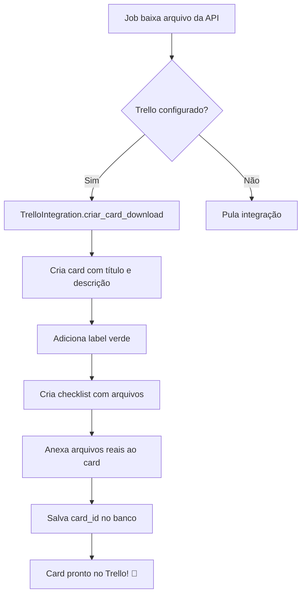

# 📋 DOCUMENTAÇÃO COMPLETA: INTEGRAÇÃO TRELLO

> **Guia completo de como configurar e implementar a integração com Trello para criação automática de cards quando arquivos de notas fiscais são baixados**

---

## 📋 ÍNDICE

1. [Visão Geral](#1-visão-geral)
2. [Obtenção de Credenciais](#2-obtenção-de-credenciais)
3. [Configuração no Sistema](#3-configuração-no-sistema)
4. [Estrutura do Banco de Dados](#4-estrutura-do-banco-de-dados)
5. [Implementação da Classe TrelloIntegration](#5-implementação-da-classe-trellointegration)
6. [Criação de Cards](#6-criação-de-cards)
7. [Anexação de Arquivos](#7-anexação-de-arquivos)
8. [Checklists Automáticas](#8-checklists-automáticas)
9. [Tratamento de Erros e Retry](#9-tratamento-de-erros-e-retry)
10. [Testes e Validação](#10-testes-e-validação)
11. [API Reference](#11-api-reference)
12. [Troubleshooting](#12-troubleshooting)

---

## 1. VISÃO GERAL

### 🎯 Objetivo

Criar **automaticamente** cards no Trello sempre que o sistema baixar arquivos de notas fiscais da API, contendo:
- ✅ Informações do lote/prestador/montador
- ✅ Lista de arquivos baixados
- ✅ Anexos dos arquivos reais (PDFs, XMLs, etc)
- ✅ Checklist para acompanhamento
- ✅ Labels coloridas

### 🔄 Fluxo de Integração



### 📊 Estatísticas

- ⏱️ **Tempo médio:** 2-5 segundos por card
- 📎 **Suporte:** PDFs, XMLs, PNGs, JPEGs (até 10MB cada)
- 🔄 **Retry:** 3 tentativas com timeout progressivo (30s → 60s → 90s)
- 📋 **Histórico:** Todos os cards salvos na tabela `trello_cards`

---

## 2. OBTENÇÃO DE CREDENCIAIS

### 🔑 Passo 1: Criar Power-Up (API Key)

1. **Acesse:** https://trello.com/power-ups/admin

2. **Clique em:** `New` (no canto superior direito)

3. **Preencha:**
   - **Power-Up Name:** `Novo Mundo Notas Fiscais` (ou qualquer nome)
   - **Workspace:** Selecione seu workspace
   - **Iframe connector URL:** `https://seu-dominio.com` (pode ser qualquer URL válida)
   - **Email:** Seu email

4. **Clique em:** `Create`

5. **Copie a API Key:**
   ```
   Exemplo: a1b2c3d4e5f6g7h8i9j0k1l2m3n4o5p6
   ```
   
   📋 **GUARDE ESTA CHAVE!** Ela será usada no campo `API Key` do sistema.

---

### 🎫 Passo 2: Gerar Token de Autorização

1. **Na mesma página do Power-Up**, role até a seção **"API Key"**

2. **Clique em:** `Token` (link ao lado da API Key)
   - Ou acesse diretamente: https://trello.com/1/authorize?expiration=never&name=NovoMundoNF&scope=read,write&response_type=token&key=SUA_API_KEY_AQUI

3. **Autorize o aplicativo:**
   - Clique em `Allow` (Permitir)

4. **Copie o Token:**
   ```
   Exemplo: ATTAabcd1234efgh5678ijkl9012mnop3456qrst7890uvwxyz1234567890abcd
   ```
   
   📋 **GUARDE ESTE TOKEN!** Ele será usado no campo `Token` do sistema.

---

### 📋 Passo 3: Obter Board ID

#### Método 1: Via URL do Board

1. **Abra seu board no Trello**

2. **Veja a URL:**
   ```
   https://trello.com/b/AbCd1234/nome-do-board
                        ^^^^^^^^
                        Board ID
   ```

3. **Copie o Board ID:** `AbCd1234`

#### Método 2: Via Sistema (Mais Fácil)

1. **No sistema, vá em:** Integrações → Trello

2. **Cole a API Key e Token** nos campos

3. **Clique em:** `🔍 Listar Boards`

4. **O sistema mostrará todos seus boards:**
   ```
   📋 Controle Financeiro
      Board ID: 5f8a9b1c2d3e4f5g6h7i8j9k
      URL: https://trello.com/b/5f8a9b1c/...
   
   📋 Notas Fiscais
      Board ID: AbCd1234EfGh5678IjKl9012
      URL: https://trello.com/b/AbCd1234/...
   ```

5. **Copie o Board ID desejado**

---

### 📝 Passo 4: Obter List ID

#### Método 1: Via Cartão do Board

1. **Abra um card qualquer na lista desejada**

2. **Clique em:** `Compartilhar` → `Exportar JSON`

3. **Na URL aberta, procure:**
   ```json
   {
     "idList": "5a1b2c3d4e5f6g7h8i9j0k1l"
   }
   ```

4. **Copie o `idList`**

#### Método 2: Via Sistema (Mais Fácil)

1. **No sistema, após configurar Board ID:**

2. **Clique em:** `📋 Listar Listas`

3. **O sistema mostrará todas as listas:**
   ```
   📝 A Fazer
      List ID: 5a1b2c3d4e5f6g7h8i9j0k1l
   
   📝 Em Andamento
      List ID: 6b2c3d4e5f6g7h8i9j0k1l2m
   
   📝 Concluído
      List ID: 7c3d4e5f6g7h8i9j0k1l2m3n
   ```

4. **Copie o List ID da lista onde deseja criar os cards** (geralmente "A Fazer")

---

### 📊 Resumo das Credenciais

Ao final, você terá:

| Credencial | Exemplo | Onde Usar |
|------------|---------|-----------|
| **API Key** | `a1b2c3d4e5f6g7h8i9j0k1l2m3n4o5p6` | Campo "API Key" |
| **Token** | `ATTAabcd1234efgh5678ijkl9012mnop3456...` | Campo "Token" |
| **Board ID** | `AbCd1234EfGh5678` | Campo "Board ID" |
| **List ID** | `5a1b2c3d4e5f6g7h8i9j0k1l` | Campo "List ID" |

---

## 3. CONFIGURAÇÃO NO SISTEMA

### 🖥️ Via Interface Web (Streamlit)

1. **Executar o sistema:**
   ```bash
   streamlit run streamlit_app.py
   ```

2. **Menu lateral:** Clicar em **"Integrações"**

3. **Aba Trello:**

   **🔑 Credenciais:**
   ```
   API Key: [Cole sua API Key aqui]
   Token:   [Cole seu Token aqui]
   ```

   **📍 Destino dos Cards:**
   ```
   Board ID: [Cole o Board ID aqui]
   List ID:  [Cole o List ID aqui]
   ```

   **⚙️ Configurações:**
   ```
   ☑️ Ativar integração com Trello
   ```

4. **Clicar em:** `💾 Salvar`

5. **Testar conexão:**
   - Clicar em `🔍 Listar Boards` → Deve mostrar seus boards
   - Clicar em `📋 Listar Listas` → Deve mostrar listas do board
   - Clicar em `✨ Criar Card Teste` → Deve criar um card de teste

---

### 💾 Via SQL Direto (Alternativa)

```sql
-- Atualizar configuração
UPDATE integracoes_config 
SET 
    trello_api_key = 'a1b2c3d4e5f6g7h8i9j0k1l2m3n4o5p6',
    trello_token = 'ATTAabcd1234efgh5678ijkl9012mnop3456qrst7890uvwxyz1234567890abcd',
    trello_board_id = 'AbCd1234EfGh5678',
    trello_list_id = '5a1b2c3d4e5f6g7h8i9j0k1l',
    trello_ativo = TRUE,
    data_atualizacao = NOW()
WHERE id = 1;

-- Verificar configuração
SELECT * FROM integracoes_config WHERE id = 1;
```

---

## 4. ESTRUTURA DO BANCO DE DADOS

### 📊 Tabela: `integracoes_config`

```sql
CREATE TABLE IF NOT EXISTS integracoes_config (
    id SERIAL PRIMARY KEY,
    
    -- Credenciais Trello
    trello_api_key TEXT,                    -- API Key do Trello
    trello_token TEXT,                      -- Token de autorização
    trello_board_id TEXT,                   -- ID do board de destino
    trello_list_id TEXT,                    -- ID da lista de destino
    trello_ativo BOOLEAN DEFAULT FALSE,     -- Se integração está ativa
    
    -- Metadados
    data_criacao TIMESTAMP DEFAULT NOW(),
    data_atualizacao TIMESTAMP DEFAULT NOW()
);

-- Garantir que existe ao menos um registro
INSERT INTO integracoes_config (id, trello_ativo)
VALUES (1, FALSE)
ON CONFLICT (id) DO NOTHING;
```

### 📋 Tabela: `trello_cards`

```sql
CREATE TABLE IF NOT EXISTS trello_cards (
    id SERIAL PRIMARY KEY,
    
    -- Relacionamento
    lote_id INTEGER,                        -- ID do lote de prestador
    envio_montagem_id INTEGER,              -- ID do envio de montador
    
    -- Dados do card
    card_id TEXT NOT NULL,                  -- ID do card no Trello
    card_url TEXT NOT NULL,                 -- URL curta do card
    
    -- Metadados
    data_criacao TIMESTAMP DEFAULT NOW(),
    
    -- Foreign keys
    FOREIGN KEY (lote_id) REFERENCES lotes_servico(id),
    FOREIGN KEY (envio_montagem_id) REFERENCES envios_montagem(id)
);

-- Índices para performance
CREATE INDEX idx_trello_cards_lote ON trello_cards(lote_id);
CREATE INDEX idx_trello_cards_envio ON trello_cards(envio_montagem_id);
CREATE INDEX idx_trello_cards_data ON trello_cards(data_criacao);
```

---

## 5. IMPLEMENTAÇÃO DA CLASSE TrelloIntegration

### 📁 Estrutura de Arquivos

```
projeto/
├── integracoes/
│   ├── __init__.py
│   └── trello_integration.py    ← Classe principal
├── painel_integracoes.py         ← Interface de configuração
└── job_consultar_notas.py        ← Usa a integração
```

### 🔧 Classe Principal

```python
# Arquivo: integracoes/trello_integration.py

"""
Integração com Trello
Cria cards automaticamente quando arquivos são baixados
"""

import requests
import json
import os
from datetime import datetime
from typing import Optional, Dict, Any
import database as db


class TrelloIntegration:
    """
    Cliente para integração com a API do Trello
    
    Funcionalidades:
    - Criar cards quando arquivos são baixados
    - Anexar informações do lote ao card
    - Adicionar labels personalizadas
    - Criar checklists automáticas
    - Anexar arquivos reais ao card
    """
    
    def __init__(self):
        """Inicializa a integração com as credenciais do banco"""
        self.config = self._load_config()
        self.api_key = self.config.get('trello_api_key')
        self.token = self.config.get('trello_token')
        self.board_id = self.config.get('trello_board_id')
        self.list_id = self.config.get('trello_list_id')
        self.base_url = 'https://api.trello.com/1'
        
    def _load_config(self) -> Dict[str, Any]:
        """Carrega configurações do Trello do banco de dados"""
        conn = db.get_db_connection()
        cur = conn.cursor()
        
        try:
            cur.execute("""
                SELECT 
                    trello_api_key, 
                    trello_token, 
                    trello_board_id, 
                    trello_list_id,
                    trello_ativo
                FROM integracoes_config 
                WHERE id = 1
            """)
            
            result = cur.fetchone()
            
            if result:
                return {
                    'trello_api_key': result[0],
                    'trello_token': result[1],
                    'trello_board_id': result[2],
                    'trello_list_id': result[3],
                    'trello_ativo': result[4]
                }
            else:
                return {
                    'trello_api_key': None,
                    'trello_token': None,
                    'trello_board_id': None,
                    'trello_list_id': None,
                    'trello_ativo': False
                }
        except Exception as e:
            print(f"❌ Erro ao carregar config Trello: {e}")
            return {}
        finally:
            cur.close()
            conn.close()
    
    def is_configured(self) -> bool:
        """Verifica se a integração está configurada e ativa"""
        return all([
            self.api_key,
            self.token,
            self.board_id,
            self.list_id,
            self.config.get('trello_ativo', False)
        ])
```

---

## 6. CRIAÇÃO DE CARDS

### 🎯 Método Principal

```python
def criar_card_download(
    self, 
    lote_id: int,
    prestador_nome: str,
    montador_nome: str,
    arquivos_baixados: list,
    nota_fiscal: Optional[str] = None,
    arquivos_para_anexar: Optional[list] = None,
    valor_lote: Optional[float] = None
) -> Optional[Dict[str, Any]]:
    """
    Cria um card no Trello quando arquivos são baixados
    
    Args:
        lote_id: ID do lote
        prestador_nome: Nome do prestador
        montador_nome: Nome do montador
        arquivos_baixados: Lista de nomes dos arquivos
        nota_fiscal: Número da nota fiscal (opcional)
        arquivos_para_anexar: Lista de caminhos dos arquivos locais
        valor_lote: Valor total do lote
        
    Returns:
        Dict com dados do card criado ou None se falhar
    """
    
    # 1. Verificar se está configurado
    if not self.is_configured():
        print("⚠️  Integração Trello não configurada")
        return None
    
    try:
        # 2. Montar título do card
        nome_entidade = prestador_nome if prestador_nome else montador_nome
        
        if valor_lote and valor_lote > 0:
            titulo = f"📥 NF Recebida - Lote #{lote_id} | {nome_entidade} | R$ {valor_lote:,.2f}"
        else:
            titulo = f"📥 NF Recebida - Lote #{lote_id} | {nome_entidade}"
        
        # 3. Montar descrição
        descricao = self._montar_descricao(
            lote_id, 
            prestador_nome, 
            montador_nome, 
            arquivos_baixados, 
            nota_fiscal,
            valor_lote
        )
        
        # 4. Criar o card via API
        card_data = self._criar_card_api(titulo, descricao)
        
        if not card_data:
            return None
        
        card_id = card_data['id']
        card_url = card_data['shortUrl']
        
        print(f"✅ Card Trello criado: {card_url}")
        
        # 5. Adicionar label
        self._adicionar_label(card_id, 'green')
        
        # 6. Criar checklist
        self._criar_checklist(card_id, arquivos_baixados)
        
        # 7. Anexar arquivos reais
        if arquivos_para_anexar:
            print(f"📎 Anexando {len(arquivos_para_anexar)} arquivo(s)...")
            for idx, caminho in enumerate(arquivos_para_anexar, 1):
                print(f"   [{idx}/{len(arquivos_para_anexar)}] {os.path.basename(caminho)}")
                self._anexar_arquivo(card_id, caminho)
        
        # 8. Salvar no banco
        self._salvar_card_criado(lote_id, card_id, card_url)
        
        return card_data
        
    except Exception as e:
        print(f"❌ Erro ao criar card: {e}")
        return None
```

### 🌐 Requisição à API do Trello

```python
def _criar_card_api(self, titulo: str, descricao: str) -> Optional[Dict]:
    """Cria o card via API com retry automático"""
    
    url = f"{self.base_url}/cards"
    
    # Query params apenas para autenticação
    params = {
        'key': self.api_key,
        'token': self.token
    }
    
    # Dados do card no body (evita URL muito longa)
    data = {
        'idList': self.list_id,
        'name': titulo,
        'desc': descricao,
        'pos': 'top'  # Coloca no topo da lista
    }
    
    # Retry progressivo
    max_tentativas = 3
    timeouts = [30, 60, 90]  # Segundos
    
    for tentativa in range(max_tentativas):
        try:
            print(f"🔄 Tentativa {tentativa + 1}/{max_tentativas}")
            
            response = requests.post(
                url, 
                params=params, 
                json=data,
                timeout=timeouts[tentativa]
            )
            
            response.raise_for_status()
            return response.json()
            
        except requests.exceptions.Timeout:
            if tentativa < max_tentativas - 1:
                print(f"⏱️  Timeout - Retrying com {timeouts[tentativa + 1]}s...")
                continue
            else:
                print(f"❌ Timeout após {max_tentativas} tentativas")
                return None
                
        except requests.exceptions.RequestException as e:
            if tentativa < max_tentativas - 1:
                print(f"⚠️  Erro: {e} - Retrying...")
                continue
            else:
                print(f"❌ Falha após {max_tentativas} tentativas: {e}")
                return None
    
    return None
```

### 📝 Montagem da Descrição

```python
def _montar_descricao(
    self, 
    lote_id: int, 
    prestador_nome: str, 
    montador_nome: str, 
    arquivos_baixados: list,
    nota_fiscal: Optional[str],
    valor_lote: Optional[float]
) -> str:
    """Monta a descrição formatada do card em Markdown"""
    
    data_hora = datetime.now().strftime("%d/%m/%Y às %H:%M")
    
    descricao = f"""## 📋 Informações do Lote

**Lote:** #{lote_id}
"""
    
    # Adicionar prestador OU montador (não ambos)
    if prestador_nome:
        descricao += f"**Prestador:** {prestador_nome}\n"
    if montador_nome:
        descricao += f"**Montador:** {montador_nome}\n"
    
    # Adicionar valor se fornecido
    if valor_lote and valor_lote > 0:
        descricao += f"**Valor Total:** R$ {valor_lote:,.2f}\n"
    
    descricao += f"**Data/Hora:** {data_hora}\n"
    
    if nota_fiscal:
        descricao += f"**Nota Fiscal:** {nota_fiscal}\n"
    
    # Lista de arquivos
    descricao += f"\n## 📎 Arquivos Recebidos ({len(arquivos_baixados)})\n\n"
    
    for i, arquivo in enumerate(arquivos_baixados, 1):
        descricao += f"{i}. `{arquivo}`\n"
    
    # Footer
    descricao += """
---
*Card criado automaticamente pelo Sistema de Notas Fiscais*
"""
    
    return descricao
```

### 📋 Exemplo de Card Criado

**Título:**
```
📥 NF Recebida - Lote #40 | Potência Ferragista E Ar Condicionado Ltda | R$ 15.000,00
```

**Descrição:**
```markdown
## 📋 Informações do Lote

**Lote:** #40
**Prestador:** Potência Ferragista E Ar Condicionado Ltda
**Montador:** João da Silva
**Valor Total:** R$ 15.000,00
**Data/Hora:** 15/10/2025 às 19:54
**Nota Fiscal:** NF-12345

## 📎 Arquivos Recebidos (2)

1. `Relatorio_Potencia_Ferragista_Lote_40.pdf`
2. `NFe_12345.xml`

---
*Card criado automaticamente pelo Sistema de Notas Fiscais*
```

---

## 7. ANEXAÇÃO DE ARQUIVOS

### 📎 Método de Anexação

```python
def _anexar_arquivo(self, card_id: str, caminho_arquivo: str) -> bool:
    """
    Faz upload de um arquivo real como anexo ao card
    
    Args:
        card_id: ID do card no Trello
        caminho_arquivo: Caminho completo do arquivo local
        
    Returns:
        True se sucesso, False se falhou
    """
    import logging
    logger = logging.getLogger('TrelloIntegration')
    
    # 1. Verificar se arquivo existe
    if not os.path.isfile(caminho_arquivo):
        msg = f"⚠️  Arquivo não encontrado: {caminho_arquivo}"
        print(msg)
        logger.warning(msg)
        return False
    
    tamanho = os.path.getsize(caminho_arquivo)
    print(f"   📊 Tamanho: {tamanho} bytes ({tamanho / 1024:.2f} KB)")
    
    # 2. Preparar requisição
    url = f"{self.base_url}/cards/{card_id}/attachments"
    params = {
        'key': self.api_key,
        'token': self.token
    }
    
    # 3. Retry com timeout longo (arquivos podem ser grandes)
    max_tentativas = 2
    
    for tentativa in range(max_tentativas):
        try:
            print(f"   🌐 Upload tentativa {tentativa + 1}/{max_tentativas}")
            
            with open(caminho_arquivo, 'rb') as f:
                files = {'file': (os.path.basename(caminho_arquivo), f)}
                
                response = requests.post(
                    url, 
                    params=params, 
                    files=files,
                    timeout=120  # 2 minutos para upload
                )
            
            if response.status_code == 200:
                msg = f"📎 Anexo enviado: {os.path.basename(caminho_arquivo)}"
                print(f"   ✅ {msg}")
                logger.info(msg)
                return True
            else:
                msg = f"❌ Falha ao anexar: {response.status_code} - {response.text[:200]}"
                print(f"   {msg}")
                logger.error(msg)
                
                if tentativa < max_tentativas - 1:
                    print(f"   🔄 Retrying...")
                    continue
                return False
                
        except requests.exceptions.Timeout:
            msg = f"⏱️  Timeout ao anexar: {caminho_arquivo}"
            print(f"   {msg}")
            logger.error(msg)
            
            if tentativa < max_tentativas - 1:
                print(f"   🔄 Retrying...")
                continue
            return False
            
        except Exception as e:
            msg = f"❌ Erro ao anexar: {e}"
            print(f"   {msg}")
            logger.error(msg)
            
            if tentativa < max_tentativas - 1:
                print(f"   🔄 Retrying...")
                continue
            else:
                import traceback
                traceback.print_exc()
                return False
    
    return False
```

### 📊 Limites de Upload

| Tipo | Limite |
|------|--------|
| **Tamanho máximo por arquivo** | 10 MB |
| **Formatos suportados** | PDF, PNG, JPG, JPEG, GIF, XML, TXT, DOC, DOCX, XLS, XLSX |
| **Timeout** | 120 segundos (2 minutos) |
| **Retry** | 2 tentativas |

---

## 8. CHECKLISTS AUTOMÁTICAS

### ✅ Criação de Checklist

```python
def _criar_checklist(self, card_id: str, arquivos: list) -> bool:
    """
    Cria uma checklist no card com os arquivos baixados
    
    Args:
        card_id: ID do card
        arquivos: Lista de nomes dos arquivos
        
    Returns:
        True se sucesso
    """
    try:
        # 1. Criar a checklist
        url = f"{self.base_url}/checklists"
        params = {
            'key': self.api_key,
            'token': self.token,
            'idCard': card_id,
            'name': '📋 Arquivos para Processar'
        }
        
        response = requests.post(url, params=params, timeout=30)
        response.raise_for_status()
        
        checklist_data = response.json()
        checklist_id = checklist_data['id']
        
        # 2. Adicionar cada arquivo como item
        for arquivo in arquivos:
            url = f"{self.base_url}/checklists/{checklist_id}/checkItems"
            params = {
                'key': self.api_key,
                'token': self.token,
                'name': f"📄 {arquivo}"
            }
            
            requests.post(url, params=params, timeout=30)
        
        print(f"   ✅ Checklist criada com {len(arquivos)} itens")
        return True
        
    except Exception as e:
        print(f"⚠️  Não foi possível criar checklist: {e}")
        return False
```

### 📋 Exemplo de Checklist

```
📋 Arquivos para Processar

☐ 📄 Relatorio_Potencia_Ferragista_Lote_40.pdf
☐ 📄 NFe_12345.xml
☐ 📄 Comprovante_Pagamento.pdf
```

---

## 9. TRATAMENTO DE ERROS E RETRY

### 🔄 Estratégia de Retry

```python
# Timeouts progressivos
timeouts = [30, 60, 90]  # Segundos

# Tentativas
max_tentativas = 3

# Para cada operação
for tentativa in range(max_tentativas):
    try:
        # Executar operação
        result = fazer_requisicao(timeout=timeouts[tentativa])
        return result  # Sucesso
        
    except requests.exceptions.Timeout:
        if tentativa < max_tentativas - 1:
            print(f"⏱️  Timeout - Retry {tentativa + 2}/{max_tentativas}")
            continue  # Tenta novamente
        else:
            print(f"❌ Timeout após {max_tentativas} tentativas")
            return None  # Falhou
            
    except Exception as e:
        if tentativa < max_tentativas - 1:
            print(f"⚠️  Erro: {e} - Retry {tentativa + 2}/{max_tentativas}")
            continue
        else:
            print(f"❌ Falha final: {e}")
            return None
```

### ⚠️ Tratamento de Erros Comuns

```python
try:
    response = requests.post(url, ...)
    response.raise_for_status()
    
except requests.exceptions.Timeout:
    # Timeout - servidor não respondeu a tempo
    print("⏱️  Servidor demorou demais para responder")
    
except requests.exceptions.ConnectionError:
    # Erro de conexão - sem internet ou servidor offline
    print("🌐 Erro de conexão com o Trello")
    
except requests.exceptions.HTTPError as e:
    # Erro HTTP - servidor retornou erro
    if e.response.status_code == 401:
        print("🔐 API Key ou Token inválidos")
    elif e.response.status_code == 404:
        print("🔍 Board ou Lista não encontrados")
    elif e.response.status_code == 429:
        print("⏱️  Rate limit excedido - aguarde antes de tentar novamente")
    else:
        print(f"❌ Erro HTTP {e.response.status_code}: {e.response.text}")
        
except Exception as e:
    # Erro desconhecido
    print(f"❌ Erro inesperado: {e}")
    import traceback
    traceback.print_exc()
```

---

## 10. TESTES E VALIDAÇÃO

### 🧪 Testar Configuração

#### Via Interface:

```python
# Arquivo: painel_integracoes.py

def testar_listar_boards():
    """Testa conexão listando boards do usuário"""
    with st.spinner("Conectando ao Trello..."):
        try:
            trello = TrelloIntegration()
            boards = trello.listar_boards()
            
            if boards:
                st.success(f"✅ Conexão OK! {len(boards)} boards encontrados")
                
                for board in boards:
                    with st.expander(f"📋 {board['name']}"):
                        st.code(f"Board ID: {board['id']}")
                        st.markdown(f"**URL:** {board['url']}")
            else:
                st.error("❌ Não foi possível listar boards")
                
        except ValueError as e:
            st.error(f"❌ {str(e)}")

def testar_criar_card():
    """Cria um card de teste"""
    trello = TrelloIntegration()
    
    if not trello.is_configured():
        st.warning("⚠️  Configure todos os campos primeiro")
        return
    
    with st.spinner("Criando card de teste..."):
        result = trello.criar_card_download(
            lote_id=0,
            prestador_nome="Teste de Integração",
            montador_nome="Sistema",
            arquivos_baixados=["teste1.pdf", "teste2.xml"],
            nota_fiscal="NF-TESTE-001",
            valor_lote=1000.00
        )
        
        if result:
            st.success("✅ Card de teste criado!")
            st.markdown(f"**Link:** {result['shortUrl']}")
            st.balloons()
        else:
            st.error("❌ Erro ao criar card")
```

#### Via Python:

```python
# Arquivo: testar_trello.py

from integracoes.trello_integration import TrelloIntegration

def testar_integracao():
    """Testa a integração com Trello"""
    
    print("🧪 TESTE DE INTEGRAÇÃO COM TRELLO\n")
    
    # 1. Criar instância
    trello = TrelloIntegration()
    
    # 2. Verificar configuração
    if trello.is_configured():
        print("✅ Configuração válida")
    else:
        print("❌ Configuração inválida ou incompleta")
        return
    
    # 3. Listar boards
    print("\n📋 Listando boards...")
    boards = trello.listar_boards()
    print(f"   Encontrados: {len(boards)} boards")
    for board in boards[:3]:  # Primeiros 3
        print(f"   - {board['name']} (ID: {board['id']})")
    
    # 4. Listar listas
    print("\n📝 Listando listas do board...")
    listas = trello.listar_listas(trello.board_id)
    print(f"   Encontradas: {len(listas)} listas")
    for lista in listas:
        print(f"   - {lista['name']} (ID: {lista['id']})")
    
    # 5. Criar card de teste
    print("\n✨ Criando card de teste...")
    result = trello.criar_card_download(
        lote_id=9999,
        prestador_nome="Teste Automatizado",
        montador_nome="Bot de Testes",
        arquivos_baixados=["teste1.pdf", "teste2.xml"],
        nota_fiscal="NF-TESTE-999",
        valor_lote=9999.99
    )
    
    if result:
        print(f"✅ Card criado com sucesso!")
        print(f"   URL: {result['shortUrl']}")
    else:
        print(f"❌ Falha ao criar card")
    
    print("\n🎉 Teste concluído!")

if __name__ == "__main__":
    testar_integracao()
```

---

## 11. API REFERENCE

### 🌐 Endpoints Utilizados

#### 1️⃣ Criar Card

```http
POST https://api.trello.com/1/cards
Query Params:
  - key: {API_KEY}
  - token: {TOKEN}

Body (JSON):
{
    "idList": "5a1b2c3d4e5f6g7h8i9j0k1l",
    "name": "Título do Card",
    "desc": "Descrição em Markdown",
    "pos": "top"
}

Response (200):
{
    "id": "abc123def456",
    "shortUrl": "https://trello.com/c/abc123",
    "name": "Título do Card",
    ...
}
```

#### 2️⃣ Anexar Arquivo

```http
POST https://api.trello.com/1/cards/{CARD_ID}/attachments
Query Params:
  - key: {API_KEY}
  - token: {TOKEN}

Body (multipart/form-data):
  - file: {BINARY_FILE}

Response (200):
{
    "id": "attach123",
    "name": "arquivo.pdf",
    "url": "https://trello.com/1/cards/.../attachments/.../...",
    ...
}
```

#### 3️⃣ Criar Checklist

```http
POST https://api.trello.com/1/checklists
Query Params:
  - key: {API_KEY}
  - token: {TOKEN}
  - idCard: {CARD_ID}
  - name: "Nome da Checklist"

Response (200):
{
    "id": "checklist123",
    "name": "Nome da Checklist",
    "idCard": "abc123def456",
    ...
}
```

#### 4️⃣ Adicionar Item à Checklist

```http
POST https://api.trello.com/1/checklists/{CHECKLIST_ID}/checkItems
Query Params:
  - key: {API_KEY}
  - token: {TOKEN}
  - name: "Nome do Item"

Response (200):
{
    "id": "item123",
    "name": "Nome do Item",
    "state": "incomplete",
    ...
}
```

#### 5️⃣ Listar Boards

```http
GET https://api.trello.com/1/members/me/boards
Query Params:
  - key: {API_KEY}
  - token: {TOKEN}

Response (200):
[
    {
        "id": "board123",
        "name": "Nome do Board",
        "url": "https://trello.com/b/board123/...",
        ...
    },
    ...
]
```

#### 6️⃣ Listar Listas de um Board

```http
GET https://api.trello.com/1/boards/{BOARD_ID}/lists
Query Params:
  - key: {API_KEY}
  - token: {TOKEN}

Response (200):
[
    {
        "id": "list123",
        "name": "A Fazer",
        "pos": 16384,
        ...
    },
    ...
]
```

---

## 12. TROUBLESHOOTING

### ❌ Problema: "API Key ou Token inválidos"

**Sintomas:**
- Erro 401 ao tentar listar boards
- Mensagem: "invalid key"

**Solução:**
1. Gerar novas credenciais em https://trello.com/power-ups/admin
2. Copiar API Key e Token novamente
3. Colar no sistema e salvar

---

### ❌ Problema: "Board ou Lista não encontrados"

**Sintomas:**
- Erro 404 ao criar card
- Mensagem: "board not found" ou "list not found"

**Solução:**
1. Verificar se Board ID e List ID estão corretos
2. Usar botão "Listar Boards" para ver IDs válidos
3. Usar botão "Listar Listas" para ver IDs das listas

---

### ❌ Problema: "Timeout ao criar card"

**Sintomas:**
- Card demora muito para ser criado
- Erro de timeout após 30s/60s/90s

**Solução:**
1. Verificar conexão com internet
2. Tentar novamente (sistema faz retry automático)
3. Se persistir, verificar status do Trello: https://status.trello.com/

---

### ❌ Problema: "Arquivo não anexado ao card"

**Sintomas:**
- Card criado mas sem anexos
- Mensagem: "Arquivo não encontrado"

**Solução:**
1. Verificar se arquivos existem em `uploads/lote_{id}/`
2. Verificar permissões de leitura dos arquivos
3. Verificar logs para ver erro exato

---

### ❌ Problema: "Rate limit excedido"

**Sintomas:**
- Erro 429 ao fazer muitas requisições
- Mensagem: "Rate limit exceeded"

**Solução:**
1. Aguardar alguns minutos antes de tentar novamente
2. Trello permite:
   - 300 requisições por 10 segundos
   - 100 requisições por 10 segundos por token
   - 10 MB de upload por 10 segundos

---

### ❌ Problema: "Checklist não criada"

**Sintomas:**
- Card criado mas sem checklist
- Warning: "Não foi possível criar checklist"

**Solução:**
1. Verificar se API Key e Token têm permissão de escrita
2. Tentar criar checklist manualmente no card para testar
3. Não bloqueia o fluxo principal (card é criado normalmente)

---

### 🔍 Logs de Depuração

```python
import logging

# Ativar logs detalhados
logging.basicConfig(
    level=logging.DEBUG,
    format='[%(asctime)s] [%(levelname)s] %(message)s'
)

logger = logging.getLogger('TrelloIntegration')
logger.setLevel(logging.DEBUG)
```

**Logs úteis:**
```
[2025-11-15 10:30:01] [INFO] 📎 Anexando 2 arquivo(s) ao card...
[2025-11-15 10:30:02] [INFO]    [1/2] Anexando: Relatorio_Lote_40.pdf
[2025-11-15 10:30:02] [DEBUG] Arquivo existe no disco
[2025-11-15 10:30:02] [DEBUG] Tamanho: 38353 bytes
[2025-11-15 10:30:03] [INFO] 📎 Anexo enviado com sucesso: Relatorio_Lote_40.pdf
[2025-11-15 10:30:03] [INFO]    [2/2] Anexando: NFe_12345.xml
[2025-11-15 10:30:04] [INFO] 📎 Anexo enviado com sucesso: NFe_12345.xml
[2025-11-15 10:30:04] [INFO] ✅ Card Trello criado: https://trello.com/c/abc123xyz
```

---

## 📚 RESUMO RÁPIDO

### ✅ Checklist de Configuração

- [ ] 1. Criar Power-Up no Trello
- [ ] 2. Copiar API Key
- [ ] 3. Gerar Token de autorização
- [ ] 4. Obter Board ID do board desejado
- [ ] 5. Obter List ID da lista desejada
- [ ] 6. Configurar no sistema (Interface → Integrações → Trello)
- [ ] 7. Ativar integração (checkbox)
- [ ] 8. Salvar configuração
- [ ] 9. Testar com "Listar Boards"
- [ ] 10. Testar com "Criar Card Teste"

### 📊 Fluxo Automático

```
Job baixa arquivo → TrelloIntegration.criar_card_download() →
Cria card → Adiciona label → Cria checklist → 
Anexa arquivos → Salva no banco → ✅ Concluído!
```

### 🔗 Links Úteis

- **Trello Power-Ups:** https://trello.com/power-ups/admin
- **Documentação da API:** https://developer.atlassian.com/cloud/trello/rest/
- **Status do Trello:** https://status.trello.com/
- **Suporte:** https://support.atlassian.com/trello/

---

**Documentação criada em:** 12/11/2025  
**Versão:** 1.0  
**Sistema:** Disparador de Emails Novo Mundo  
**Autor:** Sistema de Documentação Automática
