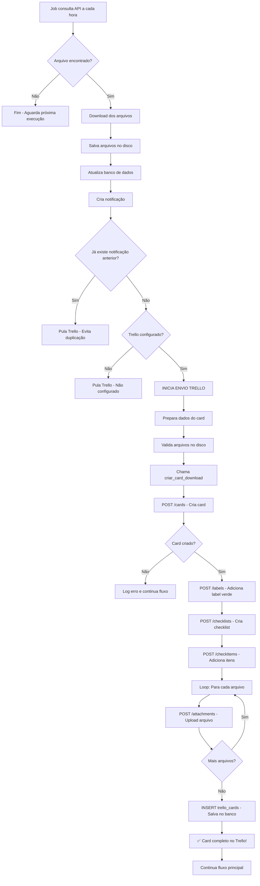

# 📤 FLUXO COMPLETO: ENVIO DE CARDS PARA O TRELLO

> **Documentação detalhada do processo completo de envio de cards para o Trello quando notas fiscais são recebidas**

---

## 📋 ÍNDICE

1. [Visão Geral do Fluxo](#1-visão-geral-do-fluxo)
2. [Pré-requisitos e Dependências](#2-pré-requisitos-e-dependências)
3. [Gatilho: Quando o Card é Enviado](#3-gatilho-quando-o-card-é-enviado)
4. [Preparação dos Dados](#4-preparação-dos-dados)
5. [Conteúdo do Card](#5-conteúdo-do-card)
6. [Processo de Envio Passo a Passo](#6-processo-de-envio-passo-a-passo)
7. [Estrutura do Card Criado](#7-estrutura-do-card-criado)
8. [Anexos e Arquivos](#8-anexos-e-arquivos)
9. [Registro no Banco de Dados](#9-registro-no-banco-de-dados)
10. [Casos de Erro e Validações](#10-casos-de-erro-e-validações)
11. [Exemplos Práticos](#11-exemplos-práticos)
12. [Logs e Monitoramento](#12-logs-e-monitoramento)

---

## 1. VISÃO GERAL DO FLUXO

### 🎯 Diagrama Completo do Fluxo



### ⏱️ Tempo Médio de Execução

| Etapa | Tempo |
|-------|-------|
| Criar card | 2-5 segundos |
| Adicionar label | 1 segundo |
| Criar checklist | 1-2 segundos |
| Anexar arquivo (cada) | 2-5 segundos |
| **Total (2 arquivos)** | **8-15 segundos** |

---

## 2. PRÉ-REQUISITOS E DEPENDÊNCIAS

### ✅ O que DEVE existir antes do envio

#### 1️⃣ **Configuração do Trello**

```sql
-- Tabela: integracoes_config
SELECT 
    trello_api_key,      -- DEVE estar preenchida
    trello_token,        -- DEVE estar preenchida
    trello_board_id,     -- DEVE estar preenchida
    trello_list_id,      -- DEVE estar preenchida
    trello_ativo         -- DEVE ser TRUE
FROM integracoes_config 
WHERE id = 1;
```

**Validação:**
```python
def is_configured(self) -> bool:
    """Verifica se TUDO está configurado"""
    return all([
        self.api_key,           # ✅ Não pode ser None ou vazio
        self.token,             # ✅ Não pode ser None ou vazio
        self.board_id,          # ✅ Não pode ser None ou vazio
        self.list_id,           # ✅ Não pode ser None ou vazio
        self.config.get('trello_ativo', False)  # ✅ DEVE ser True
    ])
```

#### 2️⃣ **Dados do Lote**

```python
# O lote DEVE ter:
lote = {
    'id': 40,                           # ✅ ID do lote
    'prestador_nome': 'Prestador X',    # ✅ Nome do prestador
    'montador_nome': 'Montador Y',      # ✅ Nome do montador (pode ser None)
    'periodo': '10/2025',               # ✅ Período
    'valor_total': 15000.00,            # ✅ Valor (pode ser 0)
}
```

#### 3️⃣ **Arquivos Baixados**

```python
# DEVE ter ao menos 1 arquivo baixado
arquivos = [
    {
        'nome_original': 'Relatorio_Lote_40.pdf',
        'tamanho_formatado': '37.45 KB',
        # ... outros campos
    }
]

# Arquivos DEVEM existir no disco
pasta_destino = f"uploads/lote_{lote_id}/"
for arquivo in arquivos:
    caminho = os.path.join(pasta_destino, arquivo['nome_original'])
    assert os.path.isfile(caminho), f"Arquivo não existe: {caminho}"
```

#### 4️⃣ **Não Duplicação**

```python
# Verificar se JÁ existe notificação (evitar duplicar cards)
cur.execute("SELECT COUNT(*) FROM notificacoes WHERE lote_id = %s", (lote_id,))
ja_tem_notificacao = cur.fetchone()[0] > 0

if ja_tem_notificacao:
    # ❌ NÃO cria card no Trello (já foi criado antes)
    return
```

---

## 3. GATILHO: QUANDO O CARD É ENVIADO

### 🚀 Momento Exato do Envio

O card é enviado **IMEDIATAMENTE APÓS** o download dos arquivos, dentro do job `job_consultar_notas.py`:

```python
# Arquivo: job_consultar_notas.py (linha ~193)

# 1. Download dos arquivos
for arquivo in arquivos:
    sucesso = client.baixar_arquivo(link, caminho_local)

# 2. Salvar no banco
db.salvar_arquivos_nf(lote_id, arquivos, stats)

# 3. Atualizar status
db.atualizar_status_arquivo(lote_id, 2)

# 4. Salvar nota fiscal
db.salvar_nota_fiscal(lote_id, primeiro_arquivo)

# 5. Calcular vencimento
db.atualizar_vencimento_lote(lote_id, data_recebimento)

# 6. Criar notificação
db.criar_notificacao(...)

# 7. 🎯 ENVIAR PARA TRELLO (ACONTECE AQUI!)
if not ja_tem_notificacao:
    try:
        trello = TrelloIntegration()
        if trello.is_configured():
            card_result = trello.criar_card_download(
                lote_id=lote_id,
                prestador_nome=prestador,
                montador_nome=montador_nome,
                arquivos_baixados=arquivos_baixados,
                nota_fiscal=nota_fiscal,
                arquivos_para_anexar=arquivos_para_anexar,
                valor_lote=valor_lote
            )
```

### 📅 Frequência

- **Job executa:** A cada hora (configurável)
- **Verifica:** Todos os lotes com `status_arquivo IN (0, 1)`
- **Envia para Trello:** Apenas quando encontra arquivos novos
- **Duplicação:** Prevenida pela verificação de notificação existente

---

## 4. PREPARAÇÃO DOS DADOS

### 📊 Coleta de Informações

```python
# Arquivo: job_consultar_notas.py (linha ~198)

# 1. Nome do montador
montador_nome = lote.get('montador_nome', 'N/A')
logger.info(f"   🔍 DEBUG: Montador = {montador_nome}")

# 2. Número da nota fiscal (se disponível)
nota_fiscal = None
if nota.get('numero_nota'):
    nota_fiscal = nota['numero_nota']

# 3. Lista de nomes dos arquivos
arquivos_baixados = [arq['nome_original'] for arq in arquivos]
# Resultado: ['Relatorio_Lote_40.pdf', 'NFe_12345.xml']

# 4. Caminhos completos dos arquivos no disco
pasta_destino = f"uploads/lote_{lote_id}/"
arquivos_para_anexar = [
    os.path.join(pasta_destino, arq['nome_original']) 
    for arq in arquivos
]
# Resultado: [
#   'uploads/lote_40/Relatorio_Lote_40.pdf',
#   'uploads/lote_40/NFe_12345.xml'
# ]

# 5. Validar que arquivos existem
logger.info(f"   📎 Arquivos para anexar no Trello:")
for caminho in arquivos_para_anexar:
    existe = os.path.isfile(caminho)
    logger.info(f"      {'✅' if existe else '❌'} {caminho}")

# 6. Valor do lote
valor_lote = lote.get('valor_total', 0)
```

### 🎯 Objeto Preparado para Envio

```python
# Dados completos enviados ao método criar_card_download()
{
    'lote_id': 40,
    'prestador_nome': 'Potência Ferragista E Ar Condicionado Ltda',
    'montador_nome': 'João da Silva',
    'arquivos_baixados': [
        'Relatorio_Potencia_Ferragista_Lote_40.pdf',
        'NFe_12345.xml'
    ],
    'nota_fiscal': 'NF-12345',
    'arquivos_para_anexar': [
        'uploads/lote_40/Relatorio_Potencia_Ferragista_Lote_40.pdf',
        'uploads/lote_40/NFe_12345.xml'
    ],
    'valor_lote': 15000.00
}
```

---

## 5. CONTEÚDO DO CARD

### 📋 Estrutura Completa do Card

#### **1. TÍTULO**

```python
# Lógica de montagem do título
nome_entidade = prestador_nome if prestador_nome else montador_nome

if valor_lote and valor_lote > 0:
    titulo = f"📥 NF Recebida - Lote #{lote_id} | {nome_entidade} | R$ {valor_lote:,.2f}"
else:
    titulo = f"📥 NF Recebida - Lote #{lote_id} | {nome_entidade}"
```

**Exemplo de Título Gerado:**
```
📥 NF Recebida - Lote #40 | Potência Ferragista E Ar Condicionado Ltda | R$ 15.000,00
```

#### **2. DESCRIÇÃO (Markdown)**

```python
def _montar_descricao(self, lote_id, prestador_nome, montador_nome, 
                      arquivos_baixados, nota_fiscal, valor_lote):
    
    data_hora = datetime.now().strftime("%d/%m/%Y às %H:%M")
    
    descricao = f"""## 📋 Informações do Lote

**Lote:** #{lote_id}
"""
    
    # Adicionar apenas prestador OU montador
    if prestador_nome:
        descricao += f"**Prestador:** {prestador_nome}\n"
    if montador_nome:
        descricao += f"**Montador:** {montador_nome}\n"
    
    # Valor (se > 0)
    if valor_lote and valor_lote > 0:
        descricao += f"**Valor Total:** R$ {valor_lote:,.2f}\n"
    
    descricao += f"**Data/Hora:** {data_hora}\n"
    
    # Nota fiscal (se informada)
    if nota_fiscal:
        descricao += f"**Nota Fiscal:** {nota_fiscal}\n"
    
    # Lista de arquivos
    descricao += f"\n## 📎 Arquivos Recebidos ({len(arquivos_baixados)})\n\n"
    
    for i, arquivo in enumerate(arquivos_baixados, 1):
        descricao += f"{i}. `{arquivo}`\n"
    
    # Footer
    descricao += """
---
*Card criado automaticamente pelo Sistema de Notas Fiscais*
"""
    
    return descricao
```

**Exemplo de Descrição Gerada:**
```markdown
## 📋 Informações do Lote

**Lote:** #40
**Prestador:** Potência Ferragista E Ar Condicionado Ltda
**Montador:** João da Silva
**Valor Total:** R$ 15.000,00
**Data/Hora:** 15/10/2025 às 19:54
**Nota Fiscal:** NF-12345

## 📎 Arquivos Recebidos (2)

1. `Relatorio_Potencia_Ferragista_Lote_40.pdf`
2. `NFe_12345.xml`

---
*Card criado automaticamente pelo Sistema de Notas Fiscais*
```

#### **3. LABEL (Cor Verde)**

```python
# Label verde = "Novo / Pendente de processamento"
self._adicionar_label(card_id, 'green')
```

#### **4. CHECKLIST**

```python
# Nome da checklist
nome_checklist = "📋 Arquivos para Processar"

# Itens da checklist (um para cada arquivo)
items = [
    "📄 Relatorio_Potencia_Ferragista_Lote_40.pdf",
    "📄 NFe_12345.xml"
]
```

**Visual no Trello:**
```
📋 Arquivos para Processar

☐ 📄 Relatorio_Potencia_Ferragista_Lote_40.pdf
☐ 📄 NFe_12345.xml
```

#### **5. ANEXOS (Arquivos Reais)**

```python
# Upload dos arquivos reais como anexos
for caminho in arquivos_para_anexar:
    self._anexar_arquivo(card_id, caminho)
```

**Resultado:**
- `Relatorio_Potencia_Ferragista_Lote_40.pdf` (37.45 KB) → Anexado ao card
- `NFe_12345.xml` (4.1 KB) → Anexado ao card

---

## 6. PROCESSO DE ENVIO PASSO A PASSO

### 🔄 Sequência Completa de Requisições

#### **PASSO 1: Criar o Card**

```http
POST https://api.trello.com/1/cards
Content-Type: application/json

Query Params:
  key: a1b2c3d4e5f6g7h8i9j0k1l2m3n4o5p6
  token: ATTAabcd1234efgh5678ijkl...

Body:
{
    "idList": "5a1b2c3d4e5f6g7h8i9j0k1l",
    "name": "📥 NF Recebida - Lote #40 | Potência Ferragista...",
    "desc": "## 📋 Informações do Lote\n\n**Lote:** #40\n...",
    "pos": "top"
}
```

**Resposta (200 OK):**
```json
{
    "id": "64f8a1b2c3d4e5f6a7b8c9d0",
    "shortUrl": "https://trello.com/c/XyZ123",
    "name": "📥 NF Recebida - Lote #40 | Potência Ferragista...",
    "desc": "## 📋 Informações do Lote...",
    "idList": "5a1b2c3d4e5f6g7h8i9j0k1l",
    "idBoard": "AbCd1234EfGh5678",
    "url": "https://trello.com/c/XyZ123/nome-do-card"
}
```

**Código:**
```python
response = requests.post(url, params=params, json=data, timeout=30)
card_data = response.json()
card_id = card_data['id']
card_url = card_data['shortUrl']
print(f"✅ Card criado: {card_url}")
```

---

#### **PASSO 2: Adicionar Label Verde**

```http
POST https://api.trello.com/1/cards/64f8a1b2c3d4e5f6a7b8c9d0/idLabels

Query Params:
  key: a1b2c3d4e5f6g7h8i9j0k1l2m3n4o5p6
  token: ATTAabcd1234efgh5678ijkl...
  value: 5c9d8e7f6a5b4c3d2e1f0a1b  (ID da label verde)
```

**Resposta (200 OK):**
```json
[
    {
        "id": "5c9d8e7f6a5b4c3d2e1f0a1b",
        "idBoard": "AbCd1234EfGh5678",
        "name": "Pendente",
        "color": "green"
    }
]
```

**Código:**
```python
# Primeiro busca as labels do board
labels = requests.get(f"{base_url}/boards/{board_id}/labels", params=params)
label_verde = next(l for l in labels.json() if l['color'] == 'green')

# Adiciona ao card
params['value'] = label_verde['id']
requests.post(f"{base_url}/cards/{card_id}/idLabels", params=params)
print(f"   🏷️  Label 'green' adicionada")
```

---

#### **PASSO 3: Criar Checklist**

```http
POST https://api.trello.com/1/checklists

Query Params:
  key: a1b2c3d4e5f6g7h8i9j0k1l2m3n4o5p6
  token: ATTAabcd1234efgh5678ijkl...
  idCard: 64f8a1b2c3d4e5f6a7b8c9d0
  name: 📋 Arquivos para Processar
```

**Resposta (200 OK):**
```json
{
    "id": "65a9b8c7d6e5f4a3b2c1d0e9",
    "name": "📋 Arquivos para Processar",
    "idCard": "64f8a1b2c3d4e5f6a7b8c9d0",
    "pos": 16384,
    "checkItems": []
}
```

**Código:**
```python
response = requests.post(
    f"{base_url}/checklists",
    params={
        'key': api_key,
        'token': token,
        'idCard': card_id,
        'name': '📋 Arquivos para Processar'
    },
    timeout=30
)
checklist_id = response.json()['id']
```

---

#### **PASSO 4: Adicionar Itens à Checklist**

```http
POST https://api.trello.com/1/checklists/65a9b8c7d6e5f4a3b2c1d0e9/checkItems

Query Params:
  key: a1b2c3d4e5f6g7h8i9j0k1l2m3n4o5p6
  token: ATTAabcd1234efgh5678ijkl...
  name: 📄 Relatorio_Potencia_Ferragista_Lote_40.pdf
```

**Resposta (200 OK):**
```json
{
    "id": "66b0c9d8e7f6a5b4c3d2e1f0",
    "name": "📄 Relatorio_Potencia_Ferragista_Lote_40.pdf",
    "state": "incomplete",
    "pos": 16384
}
```

**Código:**
```python
for arquivo in arquivos_baixados:
    requests.post(
        f"{base_url}/checklists/{checklist_id}/checkItems",
        params={
            'key': api_key,
            'token': token,
            'name': f"📄 {arquivo}"
        },
        timeout=30
    )

print(f"   ✅ Checklist criada com {len(arquivos_baixados)} itens")
```

---

#### **PASSO 5: Anexar Arquivos Reais (Loop)**

**Para cada arquivo:**

```http
POST https://api.trello.com/1/cards/64f8a1b2c3d4e5f6a7b8c9d0/attachments
Content-Type: multipart/form-data

Query Params:
  key: a1b2c3d4e5f6g7h8i9j0k1l2m3n4o5p6
  token: ATTAabcd1234efgh5678ijkl...

Body (multipart):
  file: [BINARY DATA DO ARQUIVO]
  filename: Relatorio_Potencia_Ferragista_Lote_40.pdf
```

**Resposta (200 OK):**
```json
{
    "id": "67c1d0e9f8a7b6c5d4e3f2a1",
    "bytes": 38353,
    "date": "2025-10-15T19:54:50.123Z",
    "edgeColor": null,
    "idMember": "abc123def456",
    "isUpload": true,
    "mimeType": "application/pdf",
    "name": "Relatorio_Potencia_Ferragista_Lote_40.pdf",
    "previews": [...],
    "url": "https://trello.com/1/cards/64f8a1b2.../attachments/67c1d0e9.../download/Relatorio..."
}
```

**Código:**
```python
print(f"📎 Anexando {len(arquivos_para_anexar)} arquivo(s)...")

for idx, caminho in enumerate(arquivos_para_anexar, 1):
    print(f"   [{idx}/{len(arquivos_para_anexar)}] {os.path.basename(caminho)}")
    
    # Verificar se arquivo existe
    if not os.path.isfile(caminho):
        print(f"      ⚠️  Arquivo não encontrado: {caminho}")
        continue
    
    tamanho = os.path.getsize(caminho)
    print(f"      📊 Tamanho: {tamanho} bytes")
    
    # Upload
    with open(caminho, 'rb') as f:
        files = {'file': (os.path.basename(caminho), f)}
        response = requests.post(
            f"{base_url}/cards/{card_id}/attachments",
            params={'key': api_key, 'token': token},
            files=files,
            timeout=120  # 2 minutos
        )
    
    if response.status_code == 200:
        print(f"      ✅ Anexado com sucesso!")
    else:
        print(f"      ❌ Erro: {response.status_code}")
```

---

#### **PASSO 6: Salvar no Banco de Dados**

```sql
-- Registrar que o card foi criado
INSERT INTO trello_cards (lote_id, card_id, card_url, data_criacao)
VALUES (40, '64f8a1b2c3d4e5f6a7b8c9d0', 'https://trello.com/c/XyZ123', NOW());
```

**Código:**
```python
def _salvar_card_criado(self, lote_id, card_id, card_url):
    conn = db.get_db_connection()
    cur = conn.cursor()
    
    try:
        cur.execute("""
            INSERT INTO trello_cards 
            (lote_id, card_id, card_url, data_criacao)
            VALUES (%s, %s, %s, NOW())
        """, (lote_id, card_id, card_url))
        
        conn.commit()
        print(f"   💾 Card registrado no banco")
        
    except Exception as e:
        print(f"⚠️  Erro ao salvar no banco: {e}")
        conn.rollback()
    finally:
        cur.close()
        conn.close()
```

---

## 7. ESTRUTURA DO CARD CRIADO

### 📋 Visual Final no Trello

```
┌─────────────────────────────────────────────────────────────────────┐
│ 📥 NF Recebida - Lote #40 | Potência Ferragista... | R$ 15.000,00  │
│                                                                 🟢  │
├─────────────────────────────────────────────────────────────────────┤
│                                                                     │
│ ## 📋 Informações do Lote                                          │
│                                                                     │
│ **Lote:** #40                                                      │
│ **Prestador:** Potência Ferragista E Ar Condicionado Ltda         │
│ **Montador:** João da Silva                                        │
│ **Valor Total:** R$ 15.000,00                                      │
│ **Data/Hora:** 15/10/2025 às 19:54                                │
│ **Nota Fiscal:** NF-12345                                          │
│                                                                     │
│ ## 📎 Arquivos Recebidos (2)                                       │
│                                                                     │
│ 1. `Relatorio_Potencia_Ferragista_Lote_40.pdf`                    │
│ 2. `NFe_12345.xml`                                                 │
│                                                                     │
│ ---                                                                │
│ *Card criado automaticamente pelo Sistema de Notas Fiscais*       │
│                                                                     │
├─────────────────────────────────────────────────────────────────────┤
│ 📋 Arquivos para Processar                                         │
│    ☐ 📄 Relatorio_Potencia_Ferragista_Lote_40.pdf                 │
│    ☐ 📄 NFe_12345.xml                                              │
├─────────────────────────────────────────────────────────────────────┤
│ 📎 Anexos (2)                                                      │
│    📄 Relatorio_Potencia_Ferragista_Lote_40.pdf (37.45 KB)        │
│    📄 NFe_12345.xml (4.1 KB)                                       │
└─────────────────────────────────────────────────────────────────────┘
```

---

## 8. ANEXOS E ARQUIVOS

### 📎 Processo de Upload de Arquivos

#### **Validação Pré-Upload**

```python
# 1. Verificar se arquivo existe no disco
if not os.path.isfile(caminho_arquivo):
    print(f"⚠️  Arquivo não encontrado: {caminho_arquivo}")
    return False

# 2. Verificar tamanho do arquivo
tamanho = os.path.getsize(caminho_arquivo)
print(f"📊 Tamanho: {tamanho} bytes ({tamanho / 1024:.2f} KB)")

# 3. Verificar limite (Trello: máx 10MB)
if tamanho > 10 * 1024 * 1024:  # 10 MB
    print(f"❌ Arquivo muito grande: {tamanho / 1024 / 1024:.2f} MB")
    return False
```

#### **Upload com Retry**

```python
max_tentativas = 2
timeout = 120  # 2 minutos para upload

for tentativa in range(max_tentativas):
    try:
        print(f"   🌐 Upload tentativa {tentativa + 1}/{max_tentativas}")
        
        with open(caminho_arquivo, 'rb') as f:
            files = {'file': (os.path.basename(caminho_arquivo), f)}
            
            response = requests.post(
                url,
                params={'key': api_key, 'token': token},
                files=files,
                timeout=timeout
            )
        
        if response.status_code == 200:
            print(f"   ✅ Anexo enviado com sucesso!")
            return True
        else:
            print(f"   ❌ Erro: {response.status_code} - {response.text[:200]}")
            
            if tentativa < max_tentativas - 1:
                print(f"   🔄 Tentando novamente...")
                continue
            return False
            
    except requests.exceptions.Timeout:
        print(f"   ⏱️  Timeout ao anexar arquivo")
        
        if tentativa < max_tentativas - 1:
            print(f"   🔄 Tentando novamente...")
            continue
        return False
```

#### **Tipos de Arquivo Suportados**

| Tipo | MIME Type | Extensões |
|------|-----------|-----------|
| **PDF** | `application/pdf` | `.pdf` |
| **XML** | `text/xml`, `application/xml` | `.xml` |
| **Imagem** | `image/png`, `image/jpeg` | `.png`, `.jpg`, `.jpeg` |
| **Texto** | `text/plain` | `.txt` |
| **Excel** | `application/vnd.ms-excel` | `.xls`, `.xlsx` |
| **Word** | `application/msword` | `.doc`, `.docx` |

---

## 9. REGISTRO NO BANCO DE DADOS

### 💾 Tabela: `trello_cards`

```sql
CREATE TABLE trello_cards (
    id SERIAL PRIMARY KEY,
    
    -- Relacionamento com lote
    lote_id INTEGER NOT NULL,
    
    -- Dados do card no Trello
    card_id TEXT NOT NULL,                  -- ID único do card (ex: "64f8a1b2c3d4e5f6a7b8c9d0")
    card_url TEXT NOT NULL,                 -- URL curta (ex: "https://trello.com/c/XyZ123")
    
    -- Metadados
    data_criacao TIMESTAMP DEFAULT NOW(),
    
    -- Foreign key
    FOREIGN KEY (lote_id) REFERENCES lotes_servico(id)
);
```

### 📊 Exemplo de Registro

```sql
INSERT INTO trello_cards (lote_id, card_id, card_url, data_criacao)
VALUES (
    40,
    '64f8a1b2c3d4e5f6a7b8c9d0',
    'https://trello.com/c/XyZ123',
    '2025-10-15 19:54:52'
);
```

### 🔍 Consultas Úteis

```sql
-- Ver todos os cards criados
SELECT 
    tc.id,
    tc.lote_id,
    l.prestador_nome,
    tc.card_url,
    tc.data_criacao
FROM trello_cards tc
JOIN lotes_servico l ON tc.lote_id = l.id
ORDER BY tc.data_criacao DESC;

-- Verificar se lote já tem card
SELECT COUNT(*) 
FROM trello_cards 
WHERE lote_id = 40;

-- Cards criados hoje
SELECT COUNT(*) 
FROM trello_cards 
WHERE DATE(data_criacao) = CURRENT_DATE;

-- Últimos 10 cards criados
SELECT 
    l.prestador_nome,
    tc.card_url,
    tc.data_criacao
FROM trello_cards tc
JOIN lotes_servico l ON tc.lote_id = l.id
ORDER BY tc.data_criacao DESC
LIMIT 10;
```

---

## 10. CASOS DE ERRO E VALIDAÇÕES

### ❌ Cenários de Erro e Como o Sistema Reage

#### **1. Trello Não Configurado**

```python
if not trello.is_configured():
    logger.info(f"   ℹ️  Integração Trello não configurada")
    # ✅ Sistema CONTINUA normalmente
    # ✅ Não bloqueia o fluxo principal
    # ✅ Arquivos são baixados e salvos normalmente
    return None
```

**Logs:**
```
   ℹ️  Integração Trello não configurada
```

---

#### **2. API Key ou Token Inválidos**

```python
try:
    response = requests.post(url, params=params, json=data)
    response.raise_for_status()
    
except requests.exceptions.HTTPError as e:
    if e.response.status_code == 401:
        logger.error(f"   ❌ API Key ou Token inválidos")
        # ✅ Sistema CONTINUA
        # ✅ Não cria card mas não quebra o fluxo
        return None
```

**Logs:**
```
   ❌ Erro ao criar card no Trello: 401 Unauthorized
   ⚠️  Verifique API Key e Token nas configurações
```

---

#### **3. Board ou Lista Não Encontrados**

```python
except requests.exceptions.HTTPError as e:
    if e.response.status_code == 404:
        logger.error(f"   ❌ Board ou Lista não encontrados")
        logger.error(f"   Board ID: {self.board_id}")
        logger.error(f"   List ID: {self.list_id}")
        return None
```

**Logs:**
```
   ❌ Erro ao criar card no Trello: 404 Not Found
   ❌ Board ou Lista não encontrados
   Board ID: AbCd1234EfGh5678
   List ID: 5a1b2c3d4e5f6g7h8i9j0k1l
```

---

#### **4. Timeout ao Criar Card**

```python
# Retry progressivo automático
timeouts = [30, 60, 90]  # 3 tentativas

for tentativa in range(3):
    try:
        response = requests.post(url, timeout=timeouts[tentativa])
        return response.json()
    
    except requests.exceptions.Timeout:
        if tentativa < 2:
            logger.warning(f"   ⏱️  Timeout - Retry {tentativa + 2}/3")
            continue
        else:
            logger.error(f"   ❌ Timeout após 3 tentativas")
            # ✅ Sistema CONTINUA
            return None
```

**Logs:**
```
   🔄 Tentativa 1/3 - Criando card no Trello...
   ⏱️  Timeout - Retry 2/3
   🔄 Tentativa 2/3 - Criando card no Trello...
   ⏱️  Timeout - Retry 3/3
   🔄 Tentativa 3/3 - Criando card no Trello...
   ❌ Timeout após 3 tentativas
```

---

#### **5. Arquivo Não Encontrado para Anexo**

```python
if not os.path.isfile(caminho_arquivo):
    logger.warning(f"   ⚠️  Arquivo não encontrado: {caminho_arquivo}")
    # ✅ Pula este arquivo
    # ✅ Continua anexando os próximos
    # ✅ Card ainda é criado com os outros arquivos
    return False
```

**Logs:**
```
   📎 Anexando 2 arquivo(s)...
      [1/2] Anexando: arquivo1.pdf
      ✅ Anexado com sucesso!
      [2/2] Anexando: arquivo2.xml
      ⚠️  Arquivo não encontrado: uploads/lote_40/arquivo2.xml
```

---

#### **6. Falha ao Criar Checklist**

```python
try:
    self._criar_checklist(card_id, arquivos_baixados)
except Exception as e:
    logger.warning(f"   ⚠️  Não foi possível criar checklist: {e}")
    # ✅ Sistema CONTINUA
    # ✅ Card é criado sem checklist
    # ✅ Não bloqueia o fluxo
```

**Logs:**
```
   ✅ Card Trello criado: https://trello.com/c/XyZ123
   🏷️  Label 'green' adicionada
   ⚠️  Não foi possível criar checklist: Connection timeout
   📎 Anexando 2 arquivo(s)...
```

---

#### **7. Já Existe Notificação (Evitar Duplicação)**

```python
# Verificação ANTES de criar card
cur.execute("SELECT COUNT(*) FROM notificacoes WHERE lote_id = %s", (lote_id,))
ja_tem_notificacao = cur.fetchone()[0] > 0

if ja_tem_notificacao:
    logger.info(f"   ℹ️  Card Trello já foi criado anteriormente")
    # ✅ NÃO cria card duplicado
    # ✅ Sistema CONTINUA normalmente
    return None
```

**Logs:**
```
   ℹ️  Notificação já existe para este lote
   ℹ️  Card Trello já foi criado anteriormente
```

---

#### **8. Exceção Inesperada**

```python
try:
    card_result = trello.criar_card_download(...)
    
except Exception as e:
    logger.error(f"   ⚠️  Erro ao criar card Trello: {e}")
    import traceback
    traceback.print_exc()
    # ✅ Sistema CONTINUA
    # ✅ Não interrompe o fluxo principal
    # ✅ Arquivos já foram baixados e salvos
```

**Logs:**
```
   ⚠️  Erro ao criar card Trello: 'NoneType' object has no attribute 'get'
   Traceback (most recent call last):
     File "job_consultar_notas.py", line 235, in processar_uploads_pendentes
       card_result = trello.criar_card_download(...)
     ...
```

---

## 11. EXEMPLOS PRÁTICOS

### 📝 Exemplo 1: Fluxo Completo com Sucesso

```python
# ====== CENÁRIO ======
# Lote #40 da Potência Ferragista
# 2 arquivos baixados: PDF e XML
# Trello configurado corretamente
# =====================

# Logs do job_consultar_notas.py:

[2025-10-15 19:54:46] [INFO] ────────────────────────────────────────
[2025-10-15 19:54:46] [INFO] 📦 Lote #40
[2025-10-15 19:54:46] [INFO]    👤 Prestador: Potência Ferragista E Ar Condicionado Ltda
[2025-10-15 19:54:46] [INFO]    📅 Período: 10/2025
[2025-10-15 19:54:46] [INFO]    🔑 Hash: 945a9552bea03df320c...
[2025-10-15 19:54:47] [INFO]    🔍 Consultando arquivos...
[2025-10-15 19:54:48] [INFO]    📊 Status: Link ativo
[2025-10-15 19:54:48] [INFO]    📁 Arquivos encontrados: 2
[2025-10-15 19:54:48] [INFO]    📦 Total: 41.55 KB
[2025-10-15 19:54:48] [INFO]    ⬇️  Baixando: Relatorio_Lote_40.pdf (37.45 KB)
[2025-10-15 19:54:49] [INFO]    ⬇️  Baixando: NFe_12345.xml (4.1 KB)
[2025-10-15 19:54:50] [INFO]    ✅ Dados salvos no banco
[2025-10-15 19:54:50] [INFO]    ✅ Status atualizado: Arquivos baixados
[2025-10-15 19:54:50] [INFO]    ✅ Nota fiscal salva e WhatsApp enviado
[2025-10-15 19:54:50] [INFO]    📅 Data de vencimento calculada
[2025-10-15 19:54:50] [INFO]    🔔 Notificação criada
[2025-10-15 19:54:51] [INFO]    📋 Criando card no Trello...
[2025-10-15 19:54:51] [INFO]    🔍 DEBUG: Montador = João da Silva
[2025-10-15 19:54:51] [INFO]    🔍 DEBUG: arquivos_baixados = ['Relatorio_Lote_40.pdf', 'NFe_12345.xml']
[2025-10-15 19:54:51] [INFO]    📎 Arquivos para anexar no Trello:
[2025-10-15 19:54:51] [INFO]       ✅ uploads/lote_40/Relatorio_Lote_40.pdf
[2025-10-15 19:54:51] [INFO]       ✅ uploads/lote_40/NFe_12345.xml
[2025-10-15 19:54:52] [INFO]    🔄 Tentativa 1/3 - Criando card no Trello...
[2025-10-15 19:54:53] [INFO]    ✅ Card criado: https://trello.com/c/XyZ123
[2025-10-15 19:54:54] [INFO]       🏷️  Label 'green' adicionada
[2025-10-15 19:54:55] [INFO]       ✅ Checklist criada com 2 itens
[2025-10-15 19:54:55] [INFO]    📎 Anexando 2 arquivo(s)...
[2025-10-15 19:54:55] [INFO]       [1/2] Anexando: Relatorio_Lote_40.pdf
[2025-10-15 19:54:55] [INFO]          📊 Tamanho: 38353 bytes
[2025-10-15 19:54:56] [INFO]          🌐 Upload tentativa 1/2
[2025-10-15 19:54:58] [INFO]          ✅ Anexo enviado com sucesso!
[2025-10-15 19:54:58] [INFO]       [2/2] Anexando: NFe_12345.xml
[2025-10-15 19:54:58] [INFO]          📊 Tamanho: 4199 bytes
[2025-10-15 19:54:58] [INFO]          🌐 Upload tentativa 1/2
[2025-10-15 19:54:59] [INFO]          ✅ Anexo enviado com sucesso!
[2025-10-15 19:54:59] [INFO]       💾 Card registrado no banco
[2025-10-15 19:54:59] [INFO]    ✅ Card Trello criado: https://trello.com/c/XyZ123
[2025-10-15 19:54:59] [INFO] ────────────────────────────────────────
```

**Resultado no Trello:**
- ✅ Card criado na lista "A Fazer"
- ✅ Título com lote, prestador e valor
- ✅ Descrição completa com informações
- ✅ Label verde
- ✅ Checklist com 2 arquivos
- ✅ 2 anexos (PDF + XML)

**Resultado no Banco:**
```sql
SELECT * FROM trello_cards WHERE lote_id = 40;
-- id | lote_id | card_id                      | card_url                        | data_criacao
-- 1  | 40      | 64f8a1b2c3d4e5f6a7b8c9d0    | https://trello.com/c/XyZ123    | 2025-10-15 19:54:59
```

---

### 📝 Exemplo 2: Trello Não Configurado

```python
# ====== CENÁRIO ======
# Lote #41 do Instalador ABC
# 1 arquivo baixado: PDF
# Trello NÃO configurado (trello_ativo = FALSE)
# =====================

[2025-10-15 20:10:30] [INFO] ────────────────────────────────────────
[2025-10-15 20:10:30] [INFO] 📦 Lote #41
[2025-10-15 20:10:30] [INFO]    👤 Prestador: Instalador ABC
[2025-10-15 20:10:31] [INFO]    ⬇️  Baixando: Relatorio_Lote_41.pdf
[2025-10-15 20:10:32] [INFO]    ✅ Dados salvos no banco
[2025-10-15 20:10:32] [INFO]    ✅ Status atualizado: Arquivos baixados
[2025-10-15 20:10:32] [INFO]    🔔 Notificação criada
[2025-10-15 20:10:33] [INFO]    ℹ️  Integração Trello não configurada
[2025-10-15 20:10:33] [INFO] ────────────────────────────────────────
```

**Resultado:**
- ✅ Arquivos baixados normalmente
- ✅ Banco de dados atualizado
- ✅ Notificação criada
- ❌ Card NÃO criado no Trello (mas não gera erro)
- ✅ Fluxo continua normalmente

---

### 📝 Exemplo 3: Erro de Timeout com Retry

```python
# ====== CENÁRIO ======
# Lote #42
# 3 arquivos (2 grandes: 8MB cada)
# Primeira tentativa dá timeout
# Segunda tentativa funciona
# =====================

[2025-10-15 21:05:15] [INFO]    📋 Criando card no Trello...
[2025-10-15 21:05:16] [INFO]    🔄 Tentativa 1/3 - Criando card no Trello...
[2025-10-15 21:05:46] [INFO]    ⏱️  Timeout - Retry 2/3
[2025-10-15 21:05:46] [INFO]    🔄 Tentativa 2/3 - Criando card no Trello...
[2025-10-15 21:06:10] [INFO]    ✅ Card criado: https://trello.com/c/AbC789
[2025-10-15 21:06:11] [INFO]       🏷️  Label 'green' adicionada
[2025-10-15 21:06:12] [INFO]       ✅ Checklist criada com 3 itens
[2025-10-15 21:06:12] [INFO]    📎 Anexando 3 arquivo(s)...
[2025-10-15 21:06:12] [INFO]       [1/3] Anexando: arquivo1.pdf
[2025-10-15 21:06:12] [INFO]          📊 Tamanho: 8388608 bytes (8 MB)
[2025-10-15 21:06:13] [INFO]          🌐 Upload tentativa 1/2
[2025-10-15 21:06:25] [INFO]          ✅ Anexo enviado com sucesso!
[2025-10-15 21:06:25] [INFO]       [2/3] Anexando: arquivo2.pdf
[2025-10-15 21:06:25] [INFO]          📊 Tamanho: 8388608 bytes (8 MB)
[2025-10-15 21:06:25] [INFO]          🌐 Upload tentativa 1/2
[2025-10-15 21:06:38] [INFO]          ✅ Anexo enviado com sucesso!
[2025-10-15 21:06:38] [INFO]       [3/3] Anexando: arquivo3.xml
[2025-10-15 21:06:38] [INFO]          📊 Tamanho: 5120 bytes
[2025-10-15 21:06:38] [INFO]          🌐 Upload tentativa 1/2
[2025-10-15 21:06:39] [INFO]          ✅ Anexo enviado com sucesso!
[2025-10-15 21:06:39] [INFO]    ✅ Card Trello criado: https://trello.com/c/AbC789
```

**Resultado:**
- ✅ Retry automático funcionou na 2ª tentativa
- ✅ Card criado com sucesso
- ✅ 3 anexos enviados (incluindo 2 arquivos grandes)
- ⏱️ Tempo total: ~1min 24s

---

## 12. LOGS E MONITORAMENTO

### 📊 Monitorar Cards Criados

#### **Via Banco de Dados:**

```sql
-- Cards criados hoje
SELECT COUNT(*) AS total_hoje
FROM trello_cards 
WHERE DATE(data_criacao) = CURRENT_DATE;

-- Cards criados por hora
SELECT 
    DATE_TRUNC('hour', data_criacao) AS hora,
    COUNT(*) AS total
FROM trello_cards
WHERE data_criacao >= NOW() - INTERVAL '24 hours'
GROUP BY hora
ORDER BY hora DESC;

-- Últimos 10 cards com detalhes
SELECT 
    tc.card_url,
    l.prestador_nome,
    l.periodo,
    l.valor_total,
    tc.data_criacao
FROM trello_cards tc
JOIN lotes_servico l ON tc.lote_id = l.id
ORDER BY tc.data_criacao DESC
LIMIT 10;

-- Lotes que NÃO têm card no Trello
SELECT 
    l.id,
    l.prestador_nome,
    l.periodo,
    l.data_recebimento_nf
FROM lotes_servico l
LEFT JOIN trello_cards tc ON l.lote_id = tc.lote_id
WHERE l.data_recebimento_nf IS NOT NULL
  AND tc.id IS NULL
ORDER BY l.data_recebimento_nf DESC;
```

#### **Via Logs do Scheduler:**

```bash
# Ver logs do job
tail -f scheduler.log

# Filtrar apenas logs do Trello
tail -f scheduler.log | grep -i "trello"

# Contar cards criados nos logs de hoje
grep "Card Trello criado" scheduler.log | grep "$(date +%Y-%m-%d)" | wc -l

# Ver erros do Trello
grep -i "erro.*trello" scheduler.log | tail -20
```

#### **Via Interface (Dashboard):**

```python
# Arquivo: streamlit_app.py - Dashboard

import database as db

# Total de cards criados
total_cards = db.contar_cards_trello()
st.metric("📋 Cards no Trello", total_cards)

# Cards criados hoje
cards_hoje = db.contar_cards_trello_hoje()
st.metric("📋 Cards Hoje", cards_hoje)

# Últimos cards
ultimos_cards = db.get_ultimos_cards_trello(limit=5)
for card in ultimos_cards:
    st.markdown(f"- [{card['prestador_nome']}]({card['card_url']}) - {card['data_criacao']}")
```

---

## 🎯 RESUMO EXECUTIVO

### ✅ Checklist de Envio

- [ ] **1. Configuração Trello**
  - API Key configurada
  - Token configurado
  - Board ID configurado
  - List ID configurado
  - `trello_ativo = TRUE`

- [ ] **2. Dados Disponíveis**
  - Lote existe no banco
  - Prestador/montador identificado
  - Arquivos baixados no disco

- [ ] **3. Validação**
  - Não existe notificação anterior (evitar duplicação)
  - Arquivos existem em `uploads/lote_{id}/`

- [ ] **4. Processo de Envio**
  - Criar card (3 tentativas com timeout progressivo)
  - Adicionar label verde
  - Criar checklist com arquivos
  - Anexar cada arquivo (2 tentativas cada)
  - Salvar card_id no banco

- [ ] **5. Resultado**
  - Card visível no Trello
  - Anexos disponíveis para download
  - Registro em `trello_cards` criado

### 🔄 Fluxo Simplificado

```
Arquivo baixado → Trello configurado? → Criar card → 
Adicionar label → Criar checklist → Anexar arquivos → 
Salvar no banco → ✅ Concluído
```

### ⚠️ Pontos de Atenção

1. **Não Bloqueia Fluxo:** Erros no Trello NÃO impedem download e salvamento de arquivos
2. **Retry Automático:** 3 tentativas com timeout progressivo (30s → 60s → 90s)
3. **Evita Duplicação:** Verifica notificação existente antes de criar card
4. **Logs Detalhados:** Cada etapa é logada para troubleshooting
5. **Limite de Arquivo:** Máximo 10MB por arquivo anexado

---

**Documentação criada em:** 12/11/2025  
**Versão:** 1.0  
**Sistema:** Disparador de Emails Novo Mundo  
**Módulo:** Integração Trello - Fluxo de Envio
